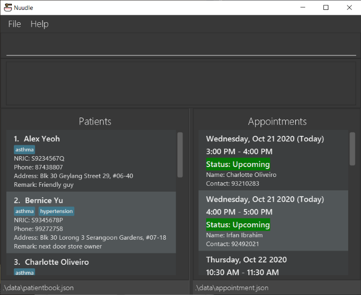

# Nuudle :ramen:

Having a tough time keeping track of patients' appointment? No time for noodles because of the never-ending appointment calls?
Fret not, Nuudle is here to help!

Nuudle is a desktop application that empowers clinic nurses, allowing them to **manage patient records and clinical appointments** with ease.
It is optimised for use via a **Command Line Interface (CLI)** and supports a beautiful Graphical User Interface (GUI).
If you can type fast, Nuudle gets your appointment scheduling tasks done faster than traditional GUI apps.

* If you are interested in using Nuudle, head over to the [_Quick Start_ section of the **User Guide**](https://ay2021s1-cs2103t-t12-4.github.io/tp/UserGuide.html#quick-start).
* If you are interested in developing Nuudle, the [**Developer Guide**](https://ay2021s1-cs2103t-t12-4.github.io/tp/DeveloperGuide.html) is a good place to start.

**Acknowledgements**

* Libraries used: [JavaFX](https://openjfx.io/), [Jackson](https://github.com/FasterXML/jackson), [JUnit5](https://github.com/junit-team/junit5)
* This project is based on the AddressBook-Level3 project created by the [SE-EDU initiative](https://se-education.org)
