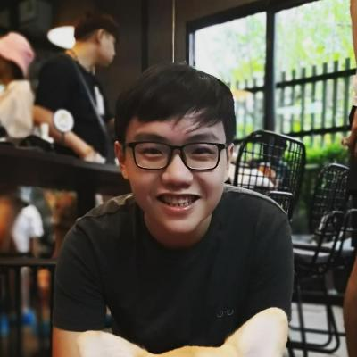
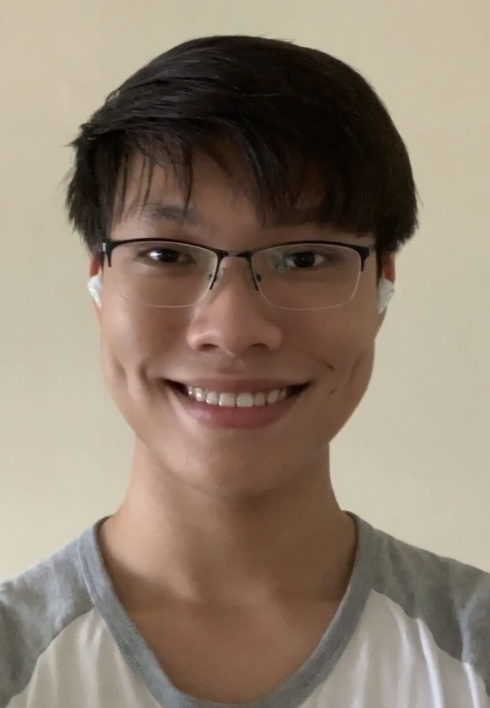
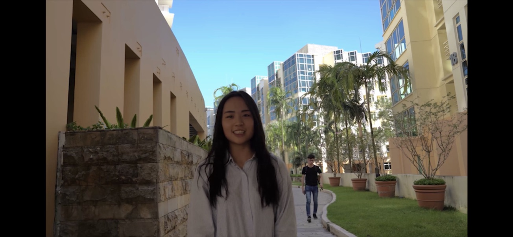
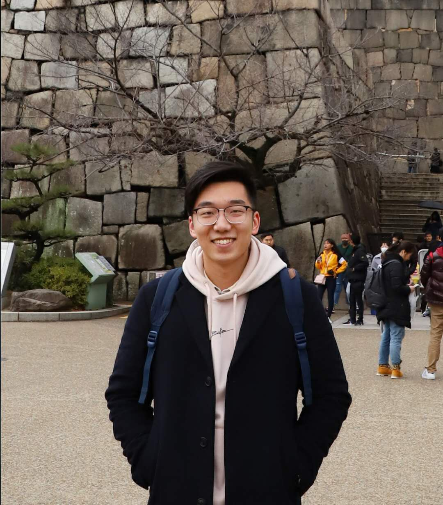

We are a team based in the [School of Computing, National University of Singapore](http://www.comp.nus.edu.sg).

You can reach us at the following emails:
* Lim Jin Hao : `jinhao_lim@u.nus.edu`
* Low Ming Lim : `m._.m@u.nus.edu`
* Zhang Wanlin : `zhangwanlin@u.nus.edu`
* Xin Zhe : `xinzhe0127@gmail.com`
* Yang Yue : `e0376999@u.nus.edu`

## Project team

### Lim Jin Hao

[[github](http://github.com/jinhao-l)]
[[portfolio](team/jinhao-l.md)]

* Role: Team Lead
* Responsibilities: Deliverables and deadlines
* In-charge of: Storage

### Low Ming Lim

[[github](https://github.com/Avalionnet)]
[[portfolio](team/avalionnet.md)]

* Role: Developer
* Responsibilities: Testing, Scheduling and Tracking
* In-charge of: Logic and Parsers

### Yang Yue

[[github](https://github.com/YangYue128-helen)]
[[portfolio](team/yangyue128-helen.md)]

* Role: Software Engineer
* Responsibilities: Code Quality
* In-charge of: Appointment Model

### Xin Zhe

[[github](http://github.com/xz0127)]
[[portfolio](team/xz0127.md)]

* Role: Software Engineer
* Responsibilities: Documentation, Integration
* In-charge of: Patient Model

### Zhang Wanlin

[[github](http://github.com/ZhangWanlin98)]
[[portfolio](team/zhangwanlin98.md)]

* Role: Software Engineer
* Responsibilities: Testing
* In-charge of: User Interface
