---
layout: page
title: Developer Guide
---
* Table of Contents
{:toc}

## **Introduction**

This document is the developer guide for Nuudle, an appointment scheduling app for nurses.

This developer guide serves to provide developers with an understanding on how Nuudle is designed.

--------------------------------------------------------------------------------------------------------------------

## **Setting up, getting started**

Refer to the guide [_Setting up and getting started_](SettingUp.md).

--------------------------------------------------------------------------------------------------------------------

## **Design**

This section describes the design & implementation of Nuudle using a top-down design.

### Architecture

The ***Architecture Diagram*** given above explains the high-level design of the App. Given below is a quick overview of each component.

:bulb: **Tip:** The `.puml` files used to create diagrams in this document can be found in the [diagrams](https://github.com/AY2021S1-CS2103T-T12-4/tp/tree/master/docs/diagrams) folder. Refer to the [_PlantUML Tutorial_ at se-edu/guides](https://se-education.org/guides/tutorials/plantUml.html) to learn how to create and edit diagrams.

**`Main`** has two classes called [`Main`](https://github.com/AY2021S1-CS2103T-T12-4/tp/blob/master/src/main/java/seedu/address/Main.java)
and [`MainApp`](https://github.com/AY2021S1-CS2103T-T12-4/tp/blob/master/src/main/java/seedu/address/MainApp.java). It is responsible for,

* At app launch: Initializes the components in the correct sequence, and connects them up with each other.
* At shut down: Shuts down the components and invokes cleanup methods where necessary.

[**`Commons`**](#common-classes) represents a collection of classes used by multiple other components.

The rest of the App consists of four components.

* [**`UI`**](#ui-component): The UI of the App.
* [**`Logic`**](#logic-component): The command executor.
* [**`Model`**](#model-component): Holds the data of the App in memory.
* [**`Storage`**](#storage-component): Reads data from, and writes data to, the hard disk.

Each of the four components,

* defines its *API* in an `interface` with the same name as the Component.
* exposes its functionality using a concrete `{Component Name}Manager` class (which implements the corresponding API `interface` mentioned in the previous point.

For example, the `Logic` component (see the class diagram given below) defines its API in the `Logic.java` interface and exposes its functionality using the `LogicManager.java` class which implements the `Logic` interface.

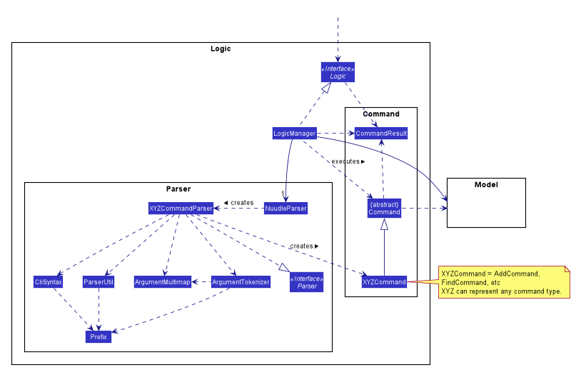

**How the architecture components interact with each other**

The *Sequence Diagram* below shows how the components interact with each other for the scenario where the user issues the command `delete 1`.

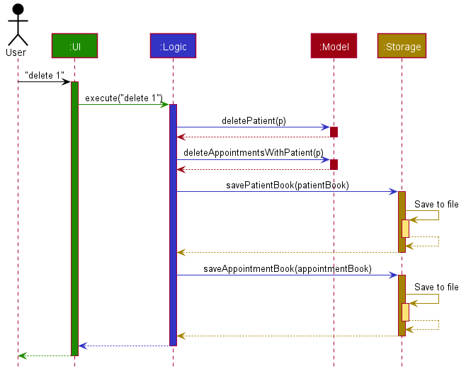

The sections below give more details of each component.

### UI component

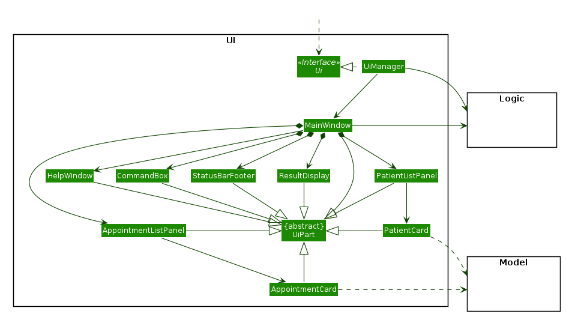

**API** :
[`Ui.java`](https://github.com/AY2021S1-CS2103T-T12-4/tp/blob/master/src/main/java/seedu/address/ui/Ui.java)

The UI consists of a `MainWindow` that is made up of parts e.g.`CommandBox`, `ResultDisplay`, `StatisticsDisplay`, `AppointmentListPanel`, `PatientListPanel`, `StatusBarFooter` etc. All these, including the `MainWindow`, inherit from the abstract `UiPart` class.

The `UI` component uses JavaFx UI framework. The layout of these UI parts are defined in matching `.fxml` files that are
 in the `src/main/resources/view` folder. For example, the layout of the [`MainWindow`](https://github.com/AY2021S1-CS2103T-T12-4/tp/blob/master/src/main/java/seedu/address/ui/MainWindow.java) is specified in [`MainWindow.fxml`](https://github.com/AY2021S1-CS2103T-T12-4/tp/blob/master/src/main/resources/view/MainWindow.fxml)

The `UI` component,

* Executes user commands using the `Logic` component.
* Listens for changes to `Model` data so that the UI can be updated with the modified data.

### Logic component

**API** :
[`Logic.java`](https://github.com/AY2021S1-CS2103T-T12-4/tp/blob/master/src/main/java/seedu/address/logic/Logic.java)

1. `LogicManager` implements the `Logic` interface and uses the `NuudleParser` class to parse the user command with the `execute` method.
1. This results in a `Command` object which is then executed by the `LogicManager`.
1. The command execution can affect the `Model` (e.g. adding or deleting a patient).
1. The result of the command execution is encapsulated as a `CommandResult` object which is passed back to the `Ui`.
1. In addition, the `CommandResult` object can also instruct the `Ui` to perform certain actions, such as displaying help to the user.

Given below is the Sequence Diagram for interactions within the `Logic` component for the `execute("delete 1")` API call.

:information_source: **Note:** The lifeline for `DeleteCommandParser` should end at the destroy marker (X) but due to a limitation of PlantUML, the lifeline reaches the end of diagram.

### Model component

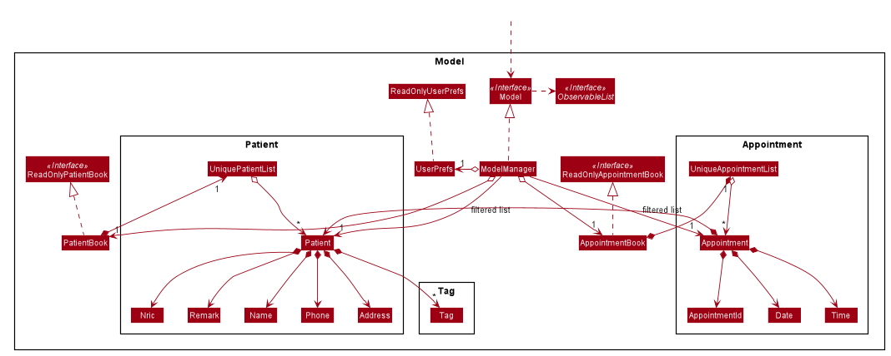

**API** : [`Model.java`](https://github.com/AY2021S1-CS2103T-T12-4/tp/blob/master/src/main/java/seedu/address/model/Model.java)

The `Model`,

* stores a `UserPref` object that represents the user’s preferences.
* stores the patient book data and appointment book data.
* exposes an unmodifiable `ObservableList<Patient>` and an unmodifiable `ObservableList<Appointment>` that can be 'observed'
e.g. the UI can be bound to these lists so that the UI automatically updates when the data in the list change.
* does not depend on any of the other three components.

:information_source: **Note:**
An alternative (arguably, a more OOP) Patient model is given below. It has a `Tag` list in the `PatientBook`, which `Patient` references. This allows `PatientBook` to only require one `Tag` object per unique `Tag`, instead of each `Patient` needing their own `Tag` object. 

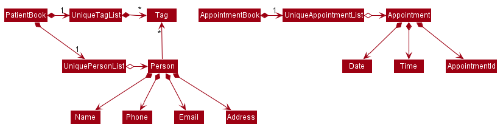

### Storage component

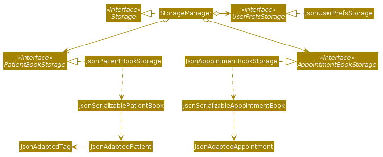

**API** : [`Storage.java`](https://github.com/AY2021S1-CS2103T-T12-4/tp/tree/master/src/main/java/seedu/address/storage/Storage.java)

The `Storage` component,
* can save `UserPref` objects in json format and read it back.
* can save the patient book data in JSON format and read it back.
* can save the appointment data in JSON format and read it back.
* can save the appointment data in CSV format for archiving.
* can handle files with invalid data by removing only the corrupted/invalid data.

### Common classes

Classes used by multiple components are in the `seedu.patientbook.commons` package.

--------------------------------------------------------------------------------------------------------------------

## **Implementation**

This section describes some noteworthy details on how certain features are implemented.

### 1. Done feature

`[written by: Yang Yue]`

The mark done feature allows users to mark a specific appointment in the appointment book as done using `APPT_INDEX` to specify the appointment in the list of appointments.

#### 1.1 Implementation
Command: `done APPT_INDEX`

Example Usage:
* `done 1`
* `done 4`

The mark appointments as Done feature is facilitated by the `DoneCommand`, which extends the abstract class `Command`, and
the `DoneCommandParser`, which implements the `Parser` interface. Both of these classes are part of the `Logic` component.

The following is an example usage scenario on how the mark as done mechanism works in each step:

1. User types `done INDEX` into the app.

2. The request is handled by `LogicManager#execute(String)`, which then calls and passes the input to the `NuudleParser#parseCommand(String)` method.

3. `NuudleParser` detects the command word `done` in the input string and creates a new `DoneCommandParser` to parse inputs according to the format specified for `DoneCommand`.

4. Input is parsed using the `DoneCommandParser#parse(String)` method, which also performs input validation. 

5. The `DoneCommandParser` creates a new `DoneCommand` instance with the given index and returns it to `NuudleParser`, which in turn returns it to `LogicManager`.

6. `LogicManager` calls the `DoneCommand#execute(Model)` method.

7. `DoneCommand` obtains a copy of the `FilteredAppointmentList` by calling the `Model#getFilteredAppointmentList()` method.

8. `DoneCommand` returns the appointment `toMark` in the `FilteredAppointmentList`, if an appointment can be found by the given index. Otherwise, throw an
`APPOINTMENT_DOES_NOT_EXISTS` exception.

9. `DoneCommand` creates another instance of this appointment `doneAppointment` which has a `done` status.

10. `DoneCommand` replaces the `toMark` with the `doneAppointment` by calling the `Model#setAppointment(Appointment, Appointment)`.

11. Lastly, `DoneCommand` creates a `CommandResult` with a `SuccessMessage` and returns it to `LogicManager`.

The above process is shown in the following sequence diagram:
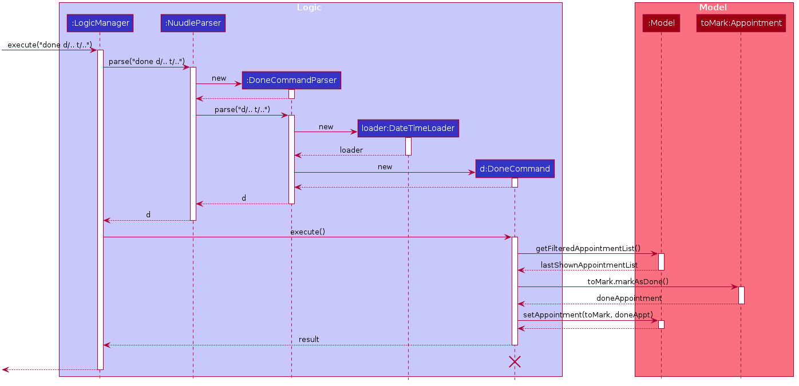
 **Diagram 1.1.1: Sequence diagram showcasing the Done Command process**

The following activity diagram summarizes what happens when a user executes a new command:
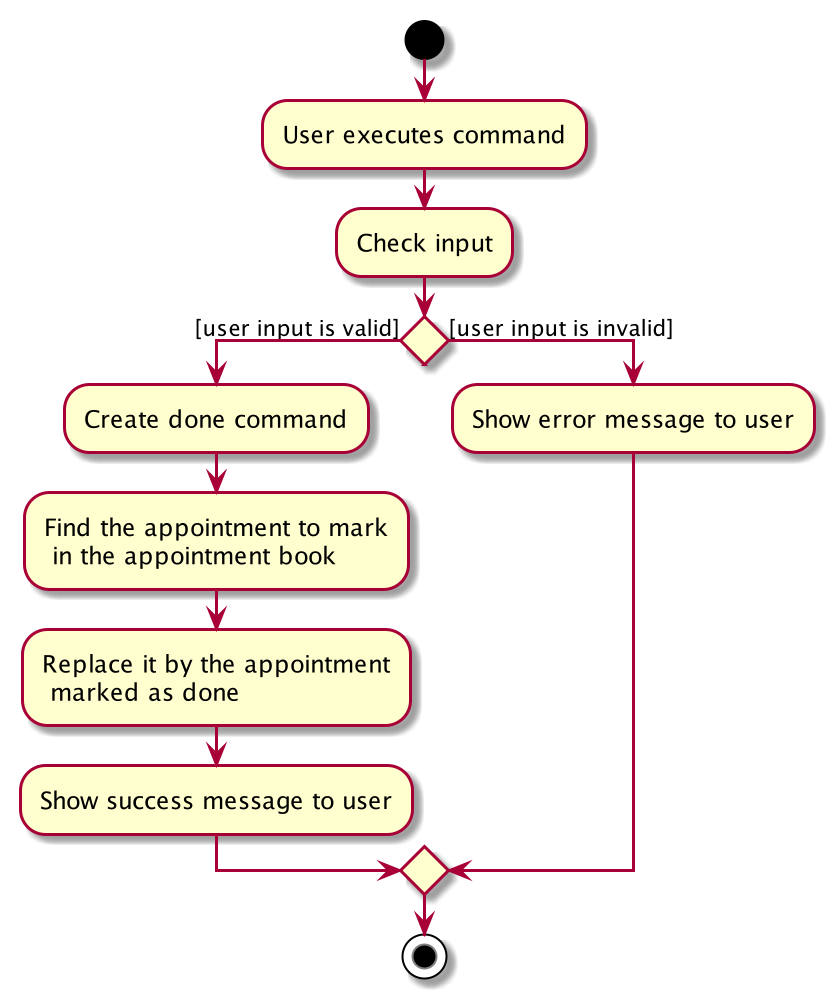
 **Diagram 1.1.2: Activity diagram showcasing the Done Command execution flow**

#### 1.2 Design consideration

##### Aspect: Input format

* **Alternative 1 (current choice):** Use `APPT_INDEX` to indicate the appointment to mark.
  * Pros: Easy to type. In this case, a user does not have to type in a long string to indicate the date and time. Easy to implement. We can find an appointment easily using the `APPT_INDEX`. Otherwise, we need to create a `DateTimeLoader` to locate the appointment in the appointment list.
  * Cons: The input does not show the date and time, so users have to scroll down the list to check whether the index points to the right appointment.

* **Alternative 2:** Use `d/DATE t/TIME` as input 
  * Pros: Without checking the list, users can tell whether the input is the right appointment they want to mark.
  * Cons: It takes more time to type `d/DATE t/TIME` comparing to a single number `INDEX` in alternative 1.

### 2. Data archiving

`[written by: Lim Jin Hao]`

The data archiving feature will archive all past appointments into an archive directory on starting the app.
The appointment data will be archived according to their months and saved as a CSV file.

The data archived will be minimal and only contains the following columns: `date`, `startTime`, `endTime`, `isDone`, `name`, `phone`, `address` and `remark`.

#### 2.1 Implementation

The archive mechanism is facilitated by `CsvAppointmentArchive` which implements the `AppointmentArchive` interface.
It is stored internally within the `JsonAppointmentBookStorage` which in turn implements the `AppointmentBookStorage` interface.

[`CsvAppointmentArchive`](https://github.com/AY2021S1-CS2103T-T12-4/tp/blob/master/src/main/java/seedu/address/storage/archive/CsvAppointmentArchive.java) implements the following operations:

* `archivePastAppointments(..)` — Removes all past appointments from the appointment book and archive the past appointments in CSV files.
* `saveAppointments(..)` — Saves the list of `CsvAdaptedAppointment` as a CSV file in the archive directory with the given filename.
* `readAppointments(..)` — Reads the CSV file with the given filename and returns the data as a list of `CsvAdaptedAppointment>`

`CsvAdaptedAppointment` and `CsvAdaptedPatient` are used to represent the CSV-adapted `Appointment` and `Patient` respectively.

 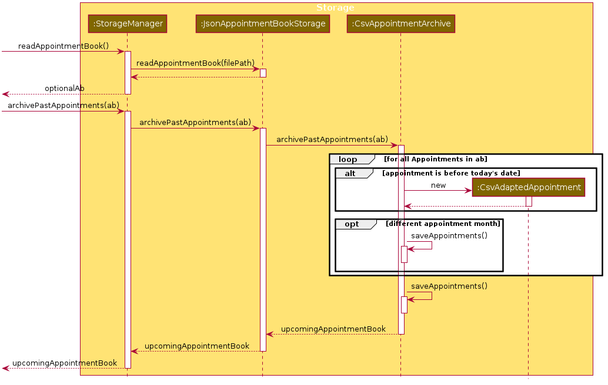
 **Diagram 2.1.1: Sequence diagram showcasing the Data Archiving process**

Given below is an example startup scenario, which focuses on how the archive mechanism behaves at each step.

1. The user launches the application with some existing appointment data.

2. The `MainApp` calls the `Storage#readAppointmentBook()` method to get the appointment book with the existing appointment data.

3. The appointment book is then passed to the `AppointmentArchive` through the `Storage` and `AppointmentBookStorage` by calling their respective `archivePastAppointments(..)` methods.

4. `AppointmentArchive` then iterates through the appointment book and separates the appointments into a list of upcoming appointments, and a list of past appointments to be archived.

5. For each past appointments, the `AppointmentArchive` creates a CSV-adapted version of the appointment, `CSVAdaptedAppointment`.

6. The `CSVAdaptedAppointment` will subsequently create a CSV-adapted version of the patient, `CSVAdaptedPatient` to be stored together with the appointment.

7. For each `CsvAdaptedAppointment` in the same month, the `AppointmentArchive` calls the `saveAppointments(..)` method to save them in a single CSV file.

8. `saveAppointments(..)` will then call the `CsvUtil#serializeObjectToCsvFile(..)` method to serialise the appointments to CSV format and save them in a file with the following naming format: `<YYYY>_<MMM>` (For eg. `2019_MAY`)

9. If the file already exists, the data will be appended to the bottom of the existing CSV file. Otherwise, a new file will be created with the CSV headers and the data of the archived past appointments.

10. The list of upcoming appointments will then be returned to the `MainApp` through the call stack and will be used by the system as the starting appointment book data.

11. The `Ui` component will then call the `Logic#getStorageStatus()` component to get the status message of the archive operation from the `StorageManager`.

12. The archive status message will then be displayed to the user via the GUI.

The retrieval of the status message is shown in the following sequence diagram:

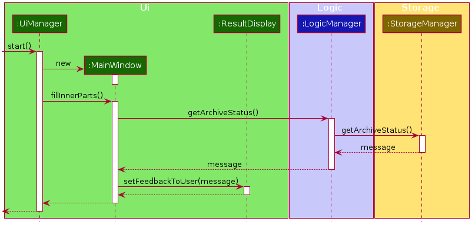
 **Diagram 2.1.2: Sequence diagram showcasing the archive message retrieval process**

The following activity diagram summarises how the Nuudle selects and archive past appointments:

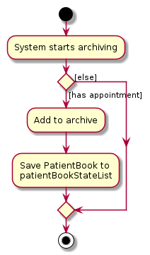
 **Diagram 2.1.3: Activity diagram showcasing the Data Archiving execution flow**

#### 2.2 Design consideration:

##### Aspect: Type of data to save in CSV format

As the data is to be saved in a CSV format, the data attributes of the Java Object cannot have complex data type such as a `set`, `list` or `map`.
`CsvAdaptedAppointment` and `CsvAdaptedPatient` classes are used to represent the archivable appointments and patient, so the consideration is to decide how and what data should be archived in the CSV file.

* **Alternative 1 (current choice):** Only archive the necessary data and ignore certain data such as `Set<Tags>` and sensitive data such as the patient's `Nric`.
  * Pros: Straightforward to implement. Easy to add and remove fields to be archived.
  * Cons: Does not have the full appointment data and therefore `CsvAdaptedAppointment` cannot be used to recreate `Appointment`.

* **Alternative 2:** Archive all appointment-related data. For complex data, convert them to their string equivalent and have methods to convert them back to the original state.
  * Pros: Full data is saved and therefore the actual `Appointment` can be recreated from the CSV data file.
  * Cons: We must ensure that the implementation of the conversion is correct and that the content of the data does not affect the conversion.

### 3. Assign Feature

`[written by: Zhang Wanlin]`

The assign feature will allow the user to create a new appointment that is attached to a patient.

#### 3.1 Implementation

The `assign` feature is implemented to allow users to assign a specified patient into a specified appointment date and time. To avoid cyclic dependency, only an `Appointment` has an attribute of `Patient` object instead of `Appointment` object and `Patient` object refer to each other.  
This feature creates a new Appointment instance, which is stored in an instance of `UniqueAppointmentList`, which in turn is stored in the `AppointmentBook`. These classes are part of the `model` component.  
The feature is supported by the `AssignCommand` class which extends the abstract class `Command`, and `AssignmentCommandParser` which implements the `Parser` interface. These classes are part of the `logic` component.  
The following class diagram showcases the relationship between the main classes that support this command and key attributes and methods:

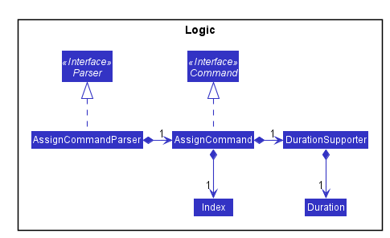

Here below is an example usage scenario and how the `assign` feature works at each step:
1. User enters respective input into the app.

2. The input is handled by the `LogicManager#execute(String)`, which then calls and passes the input to the `NuudleParser#parseCommand(String)` method.

3. `NuudleParser` finds out the command word `assign` in the user input and creates an `AssignCommandParser`to parse the input according to the format specified for `AssignCommand`.

4. `AssignCommandParser` parses the user input and checks the input validation for correct types (eg. `Integer` for `Index` and alphanumeric characters for `Name`) via the `AssignCommandParser#parser(String)` method.

5. `AssignCommandParser#parse(String)` calls the constructor of `Index` and `DurationSupporter`, and creates a new `Index` instance and a new `DurationSupporter` object with the user input. It creates a new `AssignCommand` and passes the `Index` and `DurationSupporter` to it.

6. `AssigCommand` returns the new `Command` instance to the `AssignCommandParser`, which in turn returns it to `LogicManager`.

7. `LogicManager` calls the `AssignCommand#execute(Model)` method.

8. The `AssigCommand#execute(Model)` method calls `AssignCommand#createAppointment()` to create an `Appointment`.

9. This `Appointment` instance is added into the `Model` via `Model#addAppointment()`.

10. The `Model#updateFilteredAppointmentList()` calls to update the `filteredAppointmentList` in the Model, and meanwhile checks if the `Date` and `Time` of added `Appointment` overlaps with other `Appointment` in the list.

11.  Lastly, the `AssignCommand` creates a `CommandResult` with `MESSAGE_SUCCESS`, and returns it into `LogicManager`.

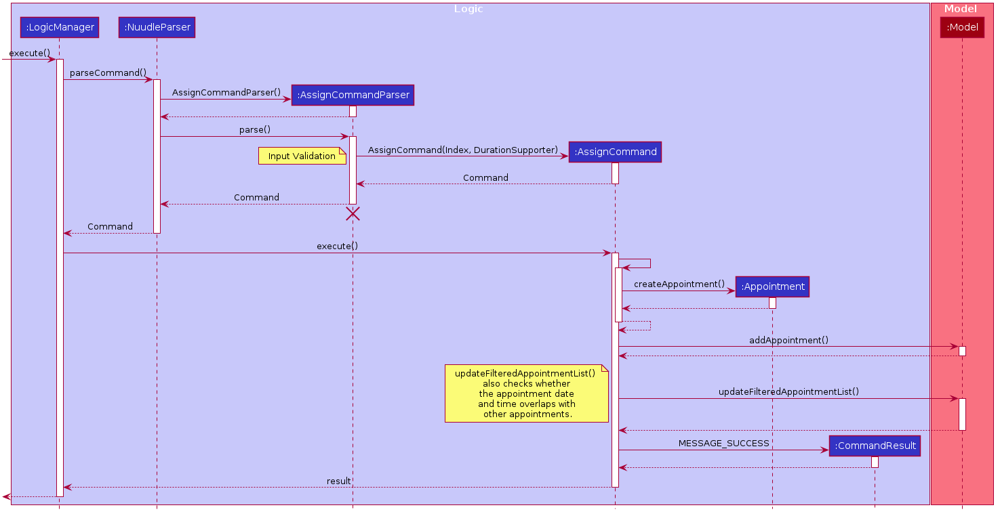

#### 3.2 Design Considerations

##### Aspect: How the `assign` command executes

* **Alternative 1 (current choice):** Separate parsing from code execution
    * Pros: Clear distinction between class responsibilities.
    * Cons: More code, may increase coupling as objects are passed around between the classes.

* **Alternative 2:** Parse and Execute in the same class
    * Pros: Less code, less fields/objects are passed between classes.
    * Cons: No separation between classes violates the Single Responsibility Principle. It also makes debugging harder since more functions are squeezed in one big class. Also, it may be harder for further developers to understand since the design would vary from the `Add` command for `Patient` (adapted from AddressBookLevel3).

##### Aspect: How to store the `Appointment` instances

* **Alternative 1 (current choice):** Store in a separate `UniqueAppointmentList` class
    * Pros: It is easier to manage `Appointment` in a separate class since many additional methods can be implemented to empower the management. Thus, This is also beneficial for other `Appointment` related commands.
    * Cons. Another class would lead to more memory usage. Since the target user needs to keep the app running, this could be disadvantageous.

* **Alternative 2:** Store inside `Patient` instances, i.e. in `UniquePatientList`.
    * Pros: Separating list is no longer needed and the usage of `UniquePatientList` would be enlarged. This might be better for hardware memory performance.
    * Cons: It hardens the issue of maintaining `Appointment` instances since the logic is that a `Patient` could have multiple `Appointment` but not the other way. As such, it would be harder for `Patient` related commands (`find`) to find the `Patient` and all his `Appointment` at once.

### 4. Edit Patient Feature

`[written by: Xin Zhe]`

The Edit Patient Feature allows the nurse to edit an existing `Patient` in the patient book.
`Appointment` which involves the patient will be updated accordingly.

#### 4.1 Implementation

The Edit Patient Feature is facilitated by the `EditCommand`, which extends the abstract class `Command`,
and the `EditCommandParser`, which implements the `Parser` interface. All of these classes are part of the `Logic` component.

This feature is supported by the `UniquePatientList` which stores the `patient` instances and the `UniqueAppointmentList`
which stores the `appointment` instances. These classes are part of the `model` component.

Additionally, a public static class `EditPatientDescriptor` is nested in `EditCommand` as a container class to store the details to edit the `Patient` with.
It also implements the following operations:

* `EditCommand#createEditedPatient(Patient patientToEdit, EditPatientDescriptor editPatientDescriptor)` — 
Creates a `patient` with the details of `patientToEdit` edited with `editPatientDescriptor`.

Given below is an example usage scenario and how the edit mechanism behaves at each step.

1: The user types `edit INDEX [n/NAME] [p/PHONE] [i/NRIC] [a/ADDRESS] [r/REMARK] [t/TAG]…` into Nuudle.

2: The request is handled by `LogicManager#execute(String)`, which then calls and passes the input to the `NuudleParser#parseCommand(String)` method.

3: `NuudleParser` detects the command word `edit` in the input string and creates a new `EditCommandParser` to parse inputs according to the format specified for `EditCommand`.

4: Input is parsed using the ·EditCommandParser#parse(String)· method, which also performs input validation. The method creates a `EditPatientDescriptor` using the parsed inputs by calling the static constructor inside `EditCommand`.

5: The `EditCommandParser` creates a new `EditCommand` instance with the given index and newly created `EditPatientDescriptor` object and returns it to `NuudleParser`, which in turn returns it to `LogicManager`.

6: `LogicManager` calls the `EditCommand#execute(Model)` method.

7: `EditCommand` obtains a copy of the `FilteredPatientList` by calling the `Model#getFilteredPatientList()` method. This is used to check if the `patient` index supplied by the user exists in Nuudle.

8: `EditCommand` creates a new `patient` specified by the `EditPatientDescriptor` by calling its own private static method `EditCommand#createEditedPatient(Patient, EditPatientDescriptor)`.

9: `EditCommand` checks whether there are duplicate patients in the patient book by calling `Model#hasPatient(Patient)` method.

10: `EditCommand` edits the `patient` at a given index by calling `Model#setPatient(Patient, Patient)`;

11: `EditCommand` edits the `appointment` in the `UniqueAppointmentList` which contains the edited patient by calling `Model#updateAppointmentsWithPatient(Patient, Patient)` method.

12: `EditCommand` updates the filtered list by calling `Model#updateFilteredPatientList(Predicate)` method.

13: `EditCommand` updates the filtered list by calling `Model#updateFilteredAppointmentList(Predicate)` method.

14: Lastly, `EditCommand` creates a `CommandResult` with `SuccessMessage` and `Patient` and returns it to `LogicManager`.

The above process is shown in the following sequence diagram:

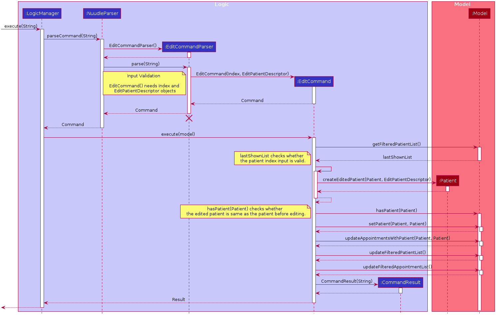
 **Diagram 4.1.1: Sequence diagram showcasing the Edit Command process**

The following activity diagram summarises the general workflow for the Edit Command:

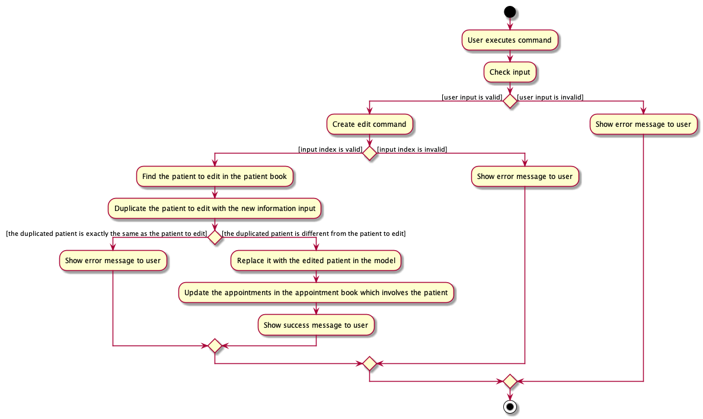
 **Diagram 4.1.2: Activity diagram showcasing the Edit Command execution flow**

#### 4.2 Design Considerations

##### Aspect: How the `edit` command executes

* **Alternative 1 (current choice):** Separate parsing from code execution
    * Pros: Separate the responsibilities clearly between classes and adhere to the Single Responsibility Principle.
    * Cons: Increases numbers of lines of code and may increase coupling as objects are passed around between the classes.

* **Alternative 2:** Parse and Execute in the same class
    * Pros: Fewer lines of code, less fields/objects are passed between classes which reduces the coupling.
    * Cons: No separation between classes violates the Single Responsibility Principle. Compromises the readability of the code and
    increases the difficulty of debugging and maintaining the code base.

##### Aspect: How to update corresponding `appointment` instance

* **Alternative 1 (current choice):** Separate updating `appointment` from editing `patient`
    * Pros: Draws clear distinction between the responsibilities of `appointmentBook` and `patientBook`. Reduces the coupling.
    * Cons: Increases numbers of lines of code and increases the cost of testing since more tests have to be carried out.

* **Alternative 2:** Update `appointment` together with `edit` patient in one function
    * Pros: Fewer lines of code. Lower cost of testing.
    * Cons: No separation between classes violates the Single Responsibility Principle. Compromises the readability of the code and
    increases the difficulty of debugging and maintaining the code base. Increases the coupling.

### 5. Remark feature

`[written by: Low Ming Lim]`

The remark feature allows users to add a custom note to a new or existing patient using the `r/` tag in multiple commands.
This provides our users with the flexibility and freedom to store extra notes or bio data for a patient apart from the compulsory
fields such as name, phone number, etc.

#### 5.1 Implementation
This feature creates a `Remark` instance which is stored internally in Nuudle as a variable of a `Patient` object
which is in turn stored in the `PatientBook`. These classes are a part of the `Model` component and are illustrated
in the class diagram below.

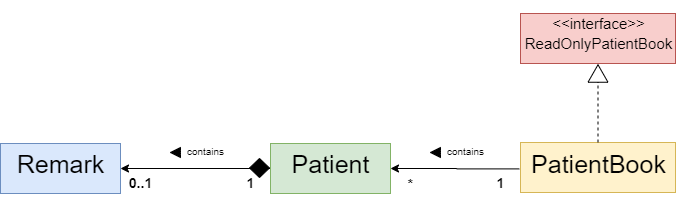
 **Diagram 5.1.1: Class diagram for classes involved in the remark feature of the Model component**

Additionally, to facilitate greater convenience for our users, we have implemented our remark feature to support the following pathways:

1. Adding a remark via the `AddCommand` for a new `Patient`:

    Command syntax: `add n/NAME i/NRIC p/PHONE_NUMBER a/ADDRESS [r/REMARK] [t/TAG]…​`

    Example Usage:
    * `add n/Betsy i/S9123456G t/friend a/NUS Utown p/1234567 r/Prefers Dr John`
    * `add n/John Doe i/S9730284G p/98765432 a/John street, block 123, #01-01 r/Regular customer`

1. Adding a remark via the `RemarkCommand` for an existing `Patient`:

    Command syntax: `remark INDEX [r/REMARK]`

    Example Usage:
    * `remark 2 r/Has been visiting Dr John`
    * `remark 1 r/Can only converse in mandarin`

1.  Or via the `EditCommand`:

    Command syntax: `edit INDEX [n/NAME] [i/NRIC] [p/PHONE_NUMBER] [a/ADDRESS] [r/REMARK] [t/TAG]…`

    Example Usage:
    * `edit 1 r/Can only converse in mandarin`
    * `edit 2 n/Betsy r/Has been visiting Dr John`

Refer to the following activity diagram for a summary of the above pathways.
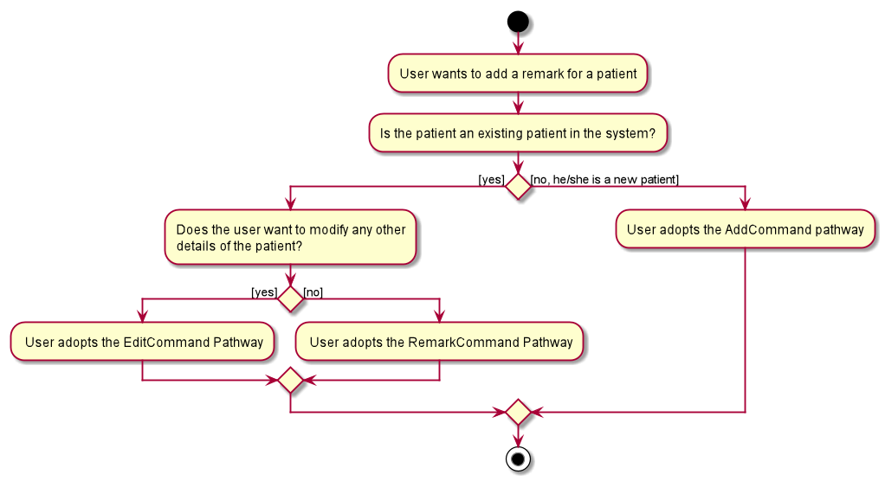
 **Diagram 5.1.2: Activity diagram showcasing available pathways to create a remark**

This segment will focus on the implementation details for the `RemarkCommand` pathway. The implementation for the
alternative `EditCommand` pathway can be found in another segment of our Developer's Guide while the implementation
 for the `AddCommand` pathway is inherited from the original AB3-Addressbook.

The addition of a remark via the remark command pathway is mainly facilitated by the `RemarkCommand` class which
extends the abstract class `Command`. A `RemarkCommandParser` which implements the `Parser` interface is required
to instantiate a `RemarkCommand` from the user input. The classes mentioned above in this paragraph resides in our
`logic` component.

#### 5.2 Implementation Illustration
 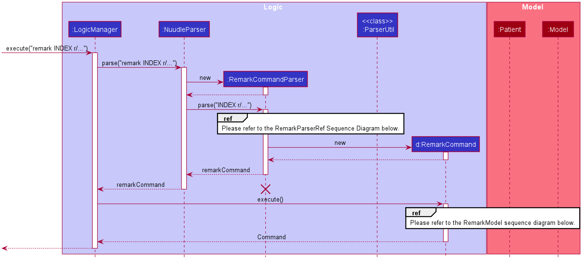
 **Diagram 5.2.1: Sequence diagram for the Remark Command**

The following is a step by step illustration of how the remark command mechanism works for an example scenario based on the sequence diagram above:

1. The user executes the `remark 1 r/Can only converse in chinese` command to add the remark `Can only ...` to the first patient
in the patient list currently displayed to the user.

2. This request is handled by `LogicManager#execute(String)`, which then calls and passes the input over to the `NuudleParser#parseCommand(String)` method.

3. During the execution of the `NuudleParser#parseCommand(String)` method, `NuudleParser` detects the command word `remark`
in the input string and creates a new `RemarkCommandParser`.

4. The `RemarkCommandParser#parse(String)` method is then subsequently called to parse the rest of the input string according to the format specified for
`RemarkCommand`. Input validation for the appropriate `Index` and `Remark` format is performed here by calling the
`ParserUtil#parseIndex` and `ParserUtil#parseRemark` methods respectively.  
 The process described in step 4 is shown in the following sequence diagram:
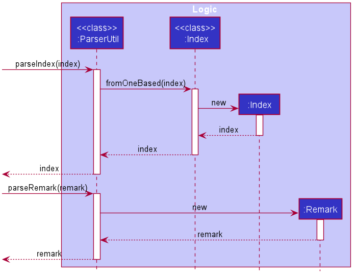
 **Diagram 5.2.2: Sequence diagram for the Remark-ParserUtil interactions**

5. The `RemarkCommandParser` then instantiates a new `RemarkCommand` with the appropriate `Index` and `Remark` object.
This new `RemarkCommand` is then returned to `NuudleParser` and subsequently `LogicManager` at the end of the `NuudleParser#parseCommand(String)` execution.

6. `LogicManager` proceeds to call the `RemarkCommand#execute(Model)` method.

7. `RemarkCommand` obtains a copy of the `FilteredPatientList` by calling the `Model#getFilteredPatientList()` method.

8. The `patientToEdit` is then identified from the `FilteredPatientList` based on the `Index` provided.

9. A new `editedPatient` is then created with the input `Remark` while the rest of its particulars are duplicated from the `patientToEdit`.

10. After all is done, the `editedPatient` is set to replace the `patientToEdit` in the `Model` via the `Model#setPatient(Patient, Patient)` method.

11. `Model#updateFilteredPatientList` is then called to update the `FilteredPatientList` displayed by the UI.
  The above process is shown in the following sequence diagram:
 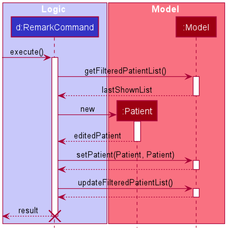
 **Diagram 5.2.3: Sequence diagram for the Remark-Model interactions**

12. Lastly, the `RemarkCommand` creates a `CommandResult` with a `SuccessMessage` and returns it to `LogicManager`.

13. The `SuccessMessage` is then displayed to the user via the GUI.

The following activity diagram summarizes the above steps when a user uses the remark command pathway:

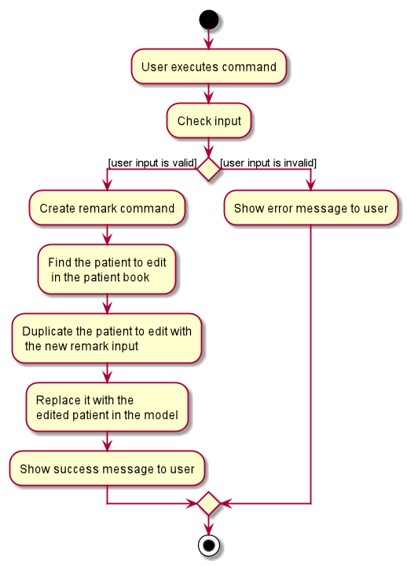
 **Diagram 5.2.4: Activity diagram showcasing the Remark Command execution flow**

#### 5.3 Design Considerations

##### Aspect: How the `remark` command executes

* **Alternative 1 (current choice):** Separate parsing from code execution
    * Pros: Responsibilities of classes are clearly distinguished. Adherence to the Single Responsibility Principle
    helps improve code cohesion. Changes to either the parser or execution will no longer affect each other.

    * Cons: Increases the code base, may increase coupling as objects are passed around between the classes.
    More tests have to be written for the respective classes, thus increasing the cost of testing.

* **Alternative 2:** Parse and Execute in the same class
    * Pros: Size of code base is reduced. Fewer objects are passed between classes thereby reducing coupling.

    * Cons: Violates the Single Responsibility Principle and reduces code readability.
    Harder for team members to maintain the code base. Increases code cohesion.
    Code design will also differ from other commands such as `Add` and `Edit` which are adapted from AddressBookLevel3.

### 6. Undo/redo feature
`[maintained by: Yang Yue]`

#### 6.1 Implementation
The proposed undo/redo mechanism is facilitated by `VersionedPatientBook` and `VersionedAppointmentBook`. They extend `PatientBook` and `AppointmentBook` respectively with an undo/redo history, stored internally as an `patientBookStateList`, `appointmentBookStateList` and `currentStatePointer`. Additionally, it implements the following operations:

* `VersionedPatientBook#commit()` — Saves the current patient book state in its history.
* `VersionedAppointmentBook#commit()` — Saves the current appointment book state in its history.
* `VersionedPatientBook#undo()` — Restores the previous patient book state from its history.
* `VersionedAppointmentBook#undo()` — Restores the previous appointment book state from its history.
* `VersionedPatientBook#redo()` — Restores a previously undone patient book state from its history.
* `VersionedAppointmentBook#redo()` — Restores a previously undone appointment book state from its history.

These operations are exposed in the `Model` interface as `Model#commitPatientBook()`, `Model#commitAppointmentBook()`, `Model#undoPatientBook()`, `Model#undoAppointmentBook()`, `Model#redoPatientBook()`, and `Model#redoAppointmentBook()` respectively.

Given below is an example usage scenario and how the undo/redo mechanism behaves at each step.

Step 1. The user launches the application for the first time. The `VersionedPatientBook` and `VersionedAppointmentBook` will be initialized with the initial patient book state and initial appointment book state, and the `currentStatePointer` pointing to that single patient book state and appointment book state.

 **Diagram 6.1.1: Diagram showcasing the initial state**

Step 2. The user executes `delete 5` command to delete the 5th person in the patient book. The `delete` command calls `Model#commitPatientBook()` and `Model#commitAppointmentBook()`, causing the modified states after the `delete 5` command executes to be saved in the `patientBookStateList` and `appointmentBookStateList`, and the `currentStatePointer` is shifted to the newly inserted state.

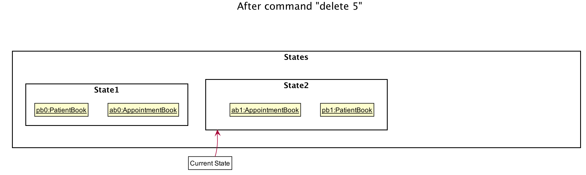
 **Diagram 6.1.2: Diagram showcasing the state after executing delete command**

Step 3. The user executes `add n/David …​` to add a new person. The `add` command also calls `Model#commitPatientBook()` and `Model#commitAppointmentBook()`, causing another modified states to be saved into the `patientBookStateList` and `appointmentBookStateList`.

 **Diagram 6.1.3: Diagram showcasing the state after executing add command**

:information_source: **Note:** If a command fails its execution, it will not call `Model#commitPatientBook()` and `Model#commitAppointmentBook()`, so the two book states will not be saved into the `patientBookStateList` and `appointmentBookStateList`.

Step 4. The user now decides that adding the person was a mistake, and decides to undo that action by executing the `undo` command. The `undo` command will call `Model#commitPatientBook()` and `Model#commitAppointmentBook()`, which will shift the `currentStatePointer` once to the left, pointing it to the previous states, and restores the patient book and appointment book to that state.

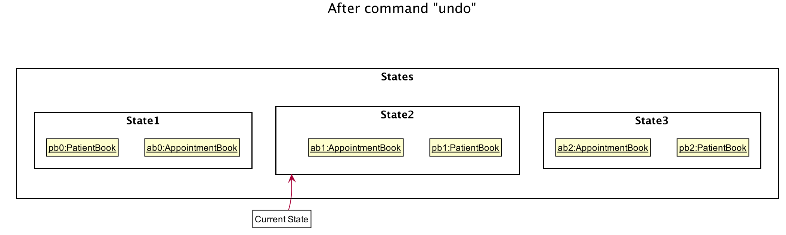
 **Diagram 6.1.4: Diagram showcasing the state after executing undo command**

:information_source: **Note:** If the `currentStatePointer` is at index 0, pointing to the initial PatientBook state and initial AppointmentBook state, then there are no previous PatientBook and AppointmentBook states to restore. The `undo` command uses `Model#canUndoPatientBook()` and `Model#canUndoAppointmentBook()` to check if this is the case. If so, it will return an error to the user rather
than attempting to perform the undo.

The following sequence diagram shows how the undo operation works:

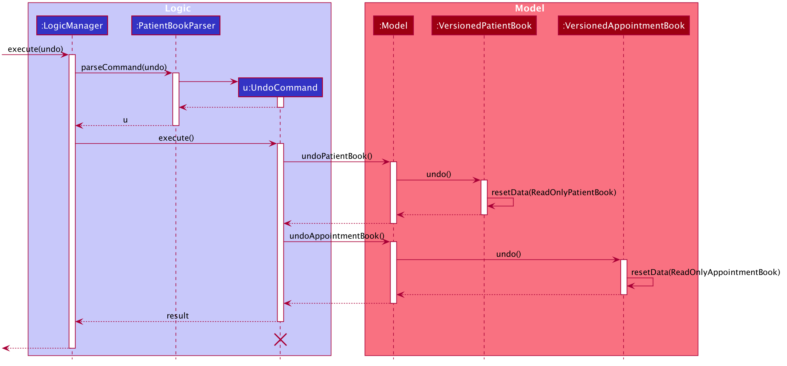
 **Diagram 6.1.5: Sequence diagram for undo command process**

:information_source: **Note:** The lifeline for `UndoCommand` should end at the destroy marker (X) but due to a limitation of PlantUML, the lifeline reaches the end of diagram.

The `redo` command does the opposite — it calls `Model#redoPatientBook()` and `Model#redoAppointmentBook()`, which shifts the `currentStatePointer` once to the right, pointing to the previously undone state, and restores the patient book and appointment book to that state.

:information_source: **Note:** If the `currentStatePointer` is at index `appointmentBookStateList.size() - 1` and `patientBookStateList.size() - 1`, pointing to the latest state, then there are no undone states to restore. The `redo` command uses `Model#canRedoAppointmentBook()` and `Model#canRedoPatientBook()` to check if this is the case. If so, it will return an error to the user rather than attempting to perform the redo.

Step 5. The user then decides to execute the command `list`. Commands that do not modify the patient book and appointment book, such as `list`, will usually not call `Model#commitPatientBook()`, `Model#commitAppointmentBook()`, `Model#undoPatientBook()` or `Model#redoPatientBook()`. Thus, the `patientBookStateList` and `appointmentBookStateList` remains unchanged.

 **Diagram 6.1.6: Diagram showcasing the state after executing list command**

Step 6. The user executes `clear`, which calls `Model#commitPatientBook()` and `Model#commitAppointmentBook()`. Since the `currentStatePointer` is not pointing at the end of the `patientBookStateList` and `appointmentBookStateList`, all states after the `currentStatePointer` will be purged. Reason: It no longer makes sense to redo the `add n/David …​` command. This is the behavior that most modern desktop applications follow.

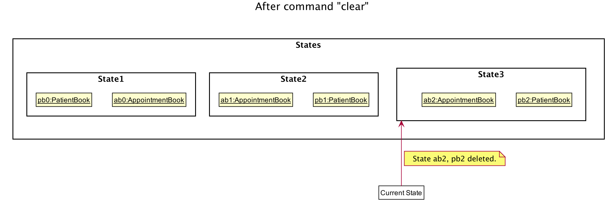
 **Diagram 6.1.7: Diagram showcasing the state after executing clear command**

The following activity diagram summarizes what happens when a user executes a new command:

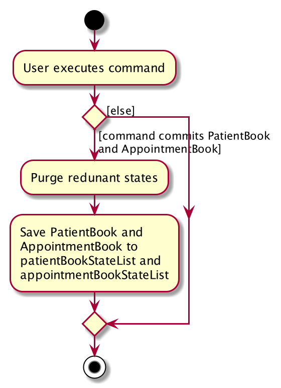
 **Diagram 6.1.8: Activity diagram showcasing the work flow of executing a new command**

#### 6.2 Design consideration:

##### Aspect: How undo & redo executes

* **Alternative 1 (current choice):** Saves the entire appointment book and patient book.
  * Pros: Easy to implement.
  * Cons: May have performance issues in terms of memory usage.

* **Alternative 2:** Individual command knows how to undo/redo by
  itself.
  * Pros: Will use less memory (e.g. for `delete`, just save the person being deleted).
  * Cons: We must ensure that the implementation of each individual command are correct.

--------------------------------------------------------------------------------------------------------------------

## **Documentation, logging, testing, configuration, dev-ops**

* [Documentation guide](Documentation.md)
* [Testing guide](Testing.md)
* [Logging guide](Logging.md)
* [Configuration guide](Configuration.md)
* [DevOps guide](DevOps.md)

--------------------------------------------------------------------------------------------------------------------

## **Appendix: Requirements**

### Product scope
**Target user profile story**:

Namise is a hard working nurse working at a popular dental clinic situated in town and gets appointment calls on an hourly basis. Swarmed with incoming calls, Namise has to make new appointments for new and existing patients while keeping track of the doctor’s schedule at the same time 😞. With the need to juggle multiple tasks at once, Namise is also prone to making careless mistakes in his work due to fatigue.

Being a tech-savvy nurse armed with a commendable experience in unix, Namise prefers to scribble down appointment schedules on paper while on call with his patients to maximise efficiency. This task is further exacerbated with the need to transfer these notes into an excel table manually later in the day.

**Target user profile summary**:
*   Nurse working in a highly popular, small scale dental clinic
*   Responsible for scheduling a large number of appointments daily
*   Add new patients to the clinic records
*   Do not entertain walk-ins and only operate on an appointment-basis
*   Required to multi-task (create appointment arrangements with patients over the phone)
*   Prone to carelessness due to the sheer number of appointments to handle
*   Tech-savvy
*   Prefers typing & wants to get things done quickly
*   Tired of transferring appointment details from paper notes to excel
*   Prefers desktop apps over other types
*   Types fast
*   Prefers typing to mouse interactions
*   Reasonably comfortable using CLI apps

**Value proposition**:

Help nurses **handle and schedule dental appointments for patients** faster than a typical mouse/GUI driven app or excel scheduling

### User stories

Priorities: High (must have) - `* * *`, Medium (nice to have) - `* *`, Low (unlikely to have) - `*`

| Priority | As a …​          | I want to …​                      | So that I can…​                                                      |
| -------- | --------------------| -------------------------------------| ------------------------------------------------------------------------|
| `* *`    | new user            | see an overview of the commands that are available to me | familiarise myself with using the app command       |
| `* * *`  | nurse               | view the entire patient list         | assign them to their appointments                                       |
| `* * *`  | administrative nurse| add new patient into the system      | assign an appointment to them                                           |
| `* * *`  | administrative nurse| delete the patient information       | manage the patient list easily when it is needed                        |
| `* * *`  | administrative nurse| search for patient by IC             | locate a patient easily                                                 |
| `* * *`  | nurse               | create patient appointment           | assign patient to a time slot for their appointment                     |
| `* * *`  | nurse               | delete an appointment                | cancel an appointment                                                   |
| `* * *`  | nurse               | view the entire appointment list for the certain day| update my dentists of the itinerary for the day          |
| `* * *`  | nurse               | mark the appointment as complete if the patient completes his/her appointment| have an accurate representation of the remaining appointments|
| `* *`    | nurse               | add diagnosis to a completed appointment| have a record of the patient’s visit                                 |
| `* *`    | administrative nurse| search for patient by phone number   | locate a patient easily                                                 |
| `* *`    | administrative nurse| search for patient by name           | locate a patient easily                                                 |
| `* *`    | administrative nurse| change the patient’s appointment if they call to postpone their appointment| update the appointment easily     |
| `* *`    | administrative nurse| edit patient’s details               | keep the information of patients up-to-date                             |
| `* *`    | nurse               | get the available time slots for a day| inform my patient of the available times for that day                  |
| `*`      | nurse               | get the next available time slot     | inform my patient of the next available timing should their original preferred choice be filled|
| `* *`    | nurse handling multiple appointments| archive records of past appointments| review them in the future                                |
| `*`      | nurse               | record the patient's existing medical condition | confirm if the medicine prescribed are suitable              |
| `*`      | nurse               | check the patient’s drug allergy     | confirm if the medicines prescribed are not in the list                 |
| `*`      | nurse               | get the number of appointments for the day | know how many appointments to expect today                        |
| `*`      | nurse               | get the number of appointments for the week | know how busy the clinic is for the week                         |

### Use cases

(For all use cases below, the **System** is the `Nuudle` and the **Actor** is the `user`, unless specified otherwise)

**Use case: UC01 - Add a patient**

**MSS**

1.  User requests to add a patient to the list.
2.  Nuudle adds the patient.

**Extensions**

* 1a. The given keywords are invalid.

    * 1a1. Nuudle shows an error message.

      Use case ends.

&nbsp;

**Use case: UC02 - Delete a patient**

**MSS**

1.  User requests to list patients.
2.  Nuudle shows a list of patients.
3.  User requests to delete a specific patient in the list.
4.  Nuudle deletes the patient.

    Use case ends.

**Extensions**

* 1a. The given keywords are invalid.

    * 1a1. Nuudle shows an error message.

      Use case ends.

* 2a. The list is empty.

  Use case ends.

* 3a. The given index is invalid.

    * 3a1. Nuudle shows an error message.

      Use case resumes at step 2.

&nbsp;

**Use case: UC03 - Edit a patient**

**MSS**

1.  User requests to find a specific patient.
2.  Nuudle shows the list of patients with the given name.
3.  User requests to edit the patient information.
4.  Nuudle changes the patient information.

    Use case ends.

**Extensions**

* 1a. The given keywords are invalid.

    * 1a1. Nuudle shows an error message.

      Use case ends.

* 3a. The given information for editing is invalid (including empty input).

    * 3a1. Nuudle shows an error message.

      Use case resumes at step 2.

&nbsp;

**Use case: UC04 - View patient record**

**MSS**

1. User requests to find a patient by name.
2. Nuudle shows the list of patients with the requested name.
3. User request to view patient record of a specific patient in the list.
4. Nuudle shows the list of records for that patient.

   Use case ends.

**Extensions**

* 1a. The given keywords are invalid.

    * 1a1. Nuudle shows an error message.

      Use case ends.

* 2a. The list is empty.

  Use case ends.

&nbsp;

**Use case: UC05 - Add an appointment**

**MSS**

1.  User requests to find an available time slot.
2.  Nuudle shows the available time slots.
3.  User requests to add an appointment to a specific time slot.
4.  Nuudle adds the appointment to the list of appointment records.

    Use case ends.

**Extensions**

* 1a. The given keywords are invalid.

    * 1a1. Nuudle shows an error message.

      Use case ends.

* 3a. The given time slot is invalid (including empty input).

    * 3a1. Nuudle shows an error message.

      Use case resumes at step 2.

&nbsp;

**Use case: UC06 - Delete an appointment**

**MSS**

1. User requests to list appointments.
2. Nuudle shows the list of appointments.
3. User requests to delete a specific appointment in the list.
4. Nuudle deletes the appointment.

   Use case ends.

**Extensions**

* 1a. The given index is invalid.

    * 1a1. Nuudle shows an error message.

      Use case ends.

* 2a. The list is empty.

  Use case ends.

&nbsp;

**Use case: UC07 - Change an appointment**

**MSS**

1.  User requests to list all appointments.
2.  Nuudle shows a list of appointments.
3.  User requests to find an available time slot.
4.  Nuudle shows the available time slots.
5.  User requests to change a specific appointment to another time.
6.  Nuudle changes the appointment.

    Use case ends.

**Extensions**

* 1a. The given keywords are invalid.

    * 1a1. Nuudle shows an error message.

      Use case ends.

* 2a. User has no current appointments.

    * 2a1. Nuudle shows an error message.

      Use case ends.

* 5a. The given time slot is invalid (including empty input).

    * 5a1. Nuudle shows an error message.

      Use case resumes at step 4.

* 5b. The given keywords are invalid.

     * 5b1. Nuudle shows an error message.

       Use case ends.

&nbsp;

**Use case: UC08 - Mark an appointment as complete**

**MSS**

1. User requests to list appointments.
2. Nuudle shows the list of appointments.
3. User requests to mark an appointment as done.
4. Nuudle marks the appointment as done.

   Use case ends.

**Extensions**

* 3a. The given index is invalid.

    * 3a1. Nuudle shows an error message.

      Use case resumes at step 2.

**Use case: UC09 - View appointments for today**

**MSS**

1.  User requests for the appointments scheduled for today.
2.  Nuudle shows a list of appointments scheduled for today.

    Use case ends.

**Extensions**

* 1a. The given keywords are invalid.

    * 1a1. Nuudle shows an error message.

      Use case ends.

* 1b. The given date is invalid.

    * 1b1. Nuudle shows an error message.

      Use case ends.

* 2a. The list is empty.

  Use case ends.

&nbsp;

**Use case: UC10 - Create an appointment for a new patient**

**MSS**

1. User requests to create a <u>new patient (UC01)</u>.
2. Nuudle creates the new patient.
3. User requests for an available time slot on a preferred day.
4. Nuudle shows the available time slots.
5. User requests to add an appointment for the new patient.
6. Nuudle creates the appointment.

   Use case ends.

**Extensions**

* 3a. The given date is invalid.

    * 3a1. Nuudle shows an error message.

      Use case resumes at step 2.

* 4a. No more time slot is available for that day.

    * 4a1. Nuudle shows the next available time slot on the nearest day.

        * 4a1a. User uses the suggested time slot.

          Use case resumes at step 5.

        * 4a1b. User does not use the suggested time slot.

          Use case resumes at step 3.

### Non-Functional Requirements

1.  Should work on any _mainstream OS_ as long as it has Java `11` or above installed.
2.  Should be able to hold up to 500 patients without a noticeable sluggishness in performance for typical usage.
3.  Should be able to hold up to 1000 upcoming appointments without a noticeable sluggishness in performance for typical usage.
4.  A user with above average typing speed for regular English text (i.e. not code, not system admin commands) should be able to accomplish most of the tasks faster using commands than using the mouse.

### Glossary

* **Mainstream OS**: Windows, Linux, Unix, OS-X
* **CSV file**: A file that stores data in [Comma-Separated Values](https://en.wikipedia.org/wiki/Comma-separated_values) format (Using commas to separate values). It can be opened using Microsoft Excel.
* **JSON file**: A file that stores object data in [JavaScript object notation](https://www.json.org/json-en.html) format

--------------------------------------------------------------------------------------------------------------------

## **Appendix: Instructions for manual testing**

Given below are instructions to test the app manually.

:information_source: **Note:** These instructions only provide a starting point for testers to work on;
testers are expected to do more *exploratory* testing.

### Launch and shutdown

1. Initial launch

   1. Download the jar file and copy into an empty folder

   1. Double-click the jar file Expected: Shows the GUI with a set of sample patients and appointments. The window size may not be optimum.

1. Saving window preferences

   1. Resize the window to an optimum size. Adjust the main split window to preferred position. Move the window to a different location. Close the window.

   1. Re-launch the app by double-clicking the jar file. 
       Expected: The most recent window size, split window position and location is retained.

### Deleting a patient

1. Deleting a patient while all patients are being shown

   1. Prerequisites: List all patients using the `list` command. Multiple patients in the list.

   1. Test case: `delete 1` 
      Expected: First patient is deleted from the list. Details of the deleted patient shown in the status message.

   1. Test case: `delete 0` 
      Expected: No patient is deleted. Error details shown in the status message.

   1. Other incorrect delete commands to try: `delete`, `delete x`, `...` (where x is larger than the list size) 
      Expected: Similar to previous.

### Creating an appointment

1. Checking the appointment status after an appointment creation

   1. Prerequisites: List all patients using the `list` command. At least one patient in the list. No appointments for today.

   1. Create an appointment by using the `assign 1 d/today t/FUTURE_TIME`, where `FUTURE_TIME` is a time that is in the near future but still lies within the operating hours.
      Expected: An appointment is created for the first patient with the indicated details. The status is shown as `Upcoming`.

   1. With the Nuudle app still running, go to your system settings and look for the `Date & Time` settings.

   1. Manually change the System Time to a time that lies within the appointment timeslot of the previously created appointment. You may have to temporarily turn off the `Set time automatically` features of your system. 
      Expected: The appointment status changes from `Upcoming` to `Ongoing`. It may take up to 30s for Nuudle to auto update. Alternatively, you can use the `list` command or click on the `appointment card to initiate a manual refresh.

   1. Now change the System Time to a time that is after the appointment timeslot of the previously created appointment. 
      Expected: The appointment status changes from `Ongoing` to `Expired`.

   1. Mark the previously created appointment as done, using the `done 1` command.
      Expected: The appointment's status changed from `Ongoing` to `Done`.

### Loading save data on launch

1. Dealing with missing/corrupted data files

   1. Prerequisites: Data save location not modified. The `preference.json` file is not edited. Multiple patients in the list.

   1. Look for the patient JSON file at the default location: `.\data\patientbook.json`

   1. Remove the `Nric` field of the first patient in the file. Note the patient name.

   1. Launch the app by double-clicking the jar file. 
      The app safely launches with multiple patients. The patient with missing Nric field is not in the list.

### Archiving data

1. Archiving past appointments

   1. Prerequisites: Have at least one upcoming appointments and no expired appointments.

   1. Locate the appointment JSON file at the default location: `.\data\appointmentbook.json`

   1. Change the `Date` field of an appointment to a past date, with month `may` and year `2019` Note the details of the appointment.

   1. Launch the app by double-clicking the jar file. 
      The app safely launches. The previously edited appointment is not in the appointment list.
      The Command Result display indicates that 1 appointment is archived.

   1. Locate the appointment CSV archive file at `.\data\archives\2019_MAY.csv`.
      The previously edited appointment should be reflected as an archived appointment.
