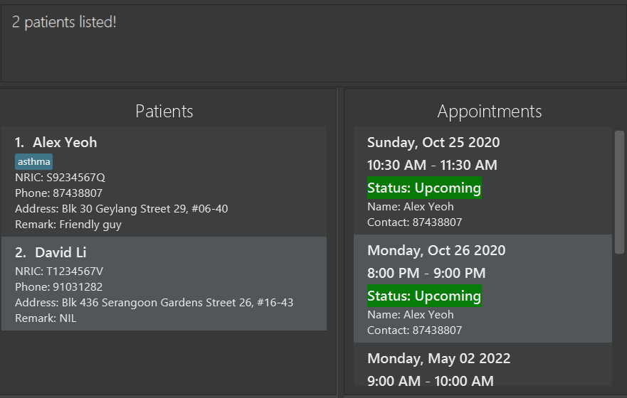

---
layout: page
title: User Guide
---

Nuudle is a **desktop app for managing patient records and clinic appointments, optimized for use via a Command Line Interface (CLI)** while still having the benefits of a Graphical User Interface (GUI). If you can type fast, Nuudle can get your patient and appointment scheduling tasks done faster than traditional GUI apps.

* Table of Contents
{:toc}

--------------------------------------------------------------------------------------------------------------------

## Quick start ( Coming Soon )

1. Ensure you have Java `11` or above installed in your Computer.

1. Download the latest `nuudle.jar` from **here** ( Coming Soon ).

1. Copy the file to the folder you want to use as the _home folder_ for Nuddle.

1. Double-click the file to start the app. The GUI similar to the below should appear in a few seconds. Note how the app contains some sample data. 
   

1. Type the command in the command box and press Enter to execute it. e.g. typing **`help`** and pressing Enter will open the help window. 
   Some example commands you can try :

   * **`list`** : Lists all patients.

   * **`add`**`add n/John Doe i/S9730284G p/98765432 a/John street, block 123, #01-01` : Adds a patient named `John Doe` to the Patient Book.

   * **`delete`**`3` : Deletes the 3rd patient shown in the current list.

   * **`edit`**`1 n/Betsy Crower p/91234567 a/College Avenue 8` : Edits the name, phone number, and address of the 1st patient in the list to be `Betsy`, `91234567`, and `College Avenue 8` respectively.
   * **`find`**`alex david` : Returns `Alex Yeoh`, `David Li` if the two names are found in the list.

   * **`clear`** : Deletes all patients.

   * **`exit`** : Exits the app.

1. Refer to the [Features](#features) below for details of each command.

--------------------------------------------------------------------------------------------------------------------

## Features

**:information_source: Notes about the command format:** 

* Words in `UPPER_CASE` are the parameters to be supplied by the user. 
  e.g. in `add n/NAME`, `NAME` is a parameter which can be used as `add n/John Doe`.

* Items in square brackets are optional. 
  e.g `n/NAME [t/TAG]` can be used as `n/John Doe t/friend` or as `n/John Doe`.

* Items with `…`​ after them can be used multiple times including zero times. 
  e.g. `[t/TAG]…​` can be used as ` ` (i.e. 0 times), `t/friend`, `t/friend t/family` etc.

* Parameters can be in any order. 
  e.g. if the command specifies `n/NAME p/PHONE_NUMBER`, `p/PHONE_NUMBER n/NAME` is also acceptable.

### Viewing help : `help`

Shows a message explaining how to access the help page of Nuudle.

Format: `help`

### Adding a patient : `add`

Adds a patient to the patient book.

Format: `add n/NAME i/NRIC p/PHONE_NUMBER a/ADDRESS [t/TAG]…​`

:bulb: **Tip:**
Tags are used to indicate a patient's underlying medical conditions. A patient can also have any number of tags (including 0).

* Adds a patient with the specified details. 
* The following fields are compulsory and must be provided: `NAME, NRIC, PHONE_NUMBER, ADDRESS`.
* It is optional to add `TAG`s for the patient. Tags can still be added with the edit command upon creating the patient entry in Nuudle.

Examples:
* `add n/John Doe i/S9730284G p/98765432 a/John street, block 123, #01-01`
* `add n/Betsy Crowe i/S9123456G t/friend a/NUS Utown p/1234567 t/asthma`

### Listing all patients : `list`

Shows a list of all patients in the patient book.

Format: `list`

### Editing a patient : `edit`

Edits an existing patient in the patient book.

Format: `edit INDEX [n/NAME] [i/NRIC] [p/PHONE_NUMBER] [a/ADDRESS] [t/TAG]…​`

* Edits the patient at the specified `INDEX`. The index refers to the index number shown in the displayed patient list. The index **must be a positive integer** 1, 2, 3, …​
* At least one of the optional fields must be provided.
* Existing values will be updated to the input values.
* When editing tags, the existing tags of the patient will be removed i.e adding of tags is not cumulative.
* You can remove all the patients' tags by typing `t/` without specifying any tags after it.

Examples:
*  `edit 1 p/91234567 a/College Avenue 8` Edits the phone number and email address of the 1st patient to be `91234567` and `College Avenue 8` respectively.
*  `edit 2 n/Betsy Crower t/` Edits the name of the 2nd patient to be `Betsy Crower` and clears all existing tags.

### Locating patients by name : `find`

Finds patients whose names contain any of the given keywords.

Format: `find KEYWORD [MORE_KEYWORDS]`

* The search is case-insensitive. e.g `hans` will match `Hans`
* The order of the keywords does not matter. e.g. `Hans Bo` will match `Bo Hans`
* Only the name is searched.
* Only full words will be matched e.g. `Han` will not match `Hans`
* Patients matching at least one keyword will be returned (i.e. `OR` search).
  e.g. `Hans Bo` will return `Hans Gruber`, `Bo Yang`

Examples:
* `find John` returns `john` and `John Doe`
* `find alex david` returns `Alex Yeoh`, `David Li` 
  

### Deleting a patient : `delete`

Deletes the specified patient from the patient book.

Format: `delete INDEX`

* Deletes the patient at the specified `INDEX`.
* The index refers to the index number shown in the displayed patient list.
* The index **must be a positive integer** 1, 2, 3, …​

Examples:
* `list` followed by `delete 2` deletes the 2nd patient in the patient book.
* `find Betsy` followed by `delete 1` deletes the 1st patient in the results of the `find` command.

### Adding a remark for a patient : `remark`

Adds a remark to an existing patient in the patient book for nurses to store additional data unique to the patient.

Format: `remark INDEX r/REMARK`

* Creates and adds a remark for the patient at the specified `INDEX`. The index refers to the index number shown in the displayed patient list. The index **must be a positive integer** 1, 2, 3, …​
* A remark serves as an optional field for a patient and can be modified using the edit command after it has been created.

Examples:
*  `remark 2 r/Has been visiting Dr John` Adds a remark `Has been visiting Dr John` to the patient currently displayed second from the top in the patient list.
*  `remark 1 r/Can only converse in mandarin` Adds a remark `Can only converse in mandarin` to the patient currently displayed at the top of the patient list.

### Adding an appointment : `assign`

Assign the specified patient into the specified appointment date and time.

Format: `assign INDEX d/DATE t/TIME [dur/DURATION]`

* Puts the patient at the specified INDEX into an appointment time slot.
* The INDEX refers to the index number indicated in the patient list.
* The INDEX **must be a positive integer** 1, 2, 3, …​
* The `DATE` and `TIME` of the appointment must be included.
* The `DURATION` is in unit of minute, with a default value of `60` when the term is omitted.
* The time slot indicated by `DATE` and `TIME` must be available.
* The specified `DATE` and `TIME` must be in the future.

Examples:
* `assign 1 d/Sunday t/2am dur/40` books an appointment of 40 minutes on the upcoming Sunday, 2am for the 1st patient in the list.
* `assign 3 d/02-03-2021 t/1130` books an appointment of 60 minutes on 02/03/2021, 11:30am for the 3rd patient in the list.

### Canceling an appointment : `cancel`

Deletes the specified appointment at the date and time indicated from the appointment book.

Format `cancel d/DATE t/TIME`

* Deletes the appointment at the specified `DATE` and `TIME`.
* The `DATE` and `TIME` indicated must take place in the future.
* An appointment with the corresponding `DATE` and `TIME` must exist in the appointment book.

Example:
* `cancel d/02/12/2020 t/10am` deletes the appointment happening on 02/12/2020 10am.
* `cancel 05-Nov-2020 t/1pm` deletes the appointment happening on 05/11/2020 1pm.

### Listing upcoming appointments by date : `view`

Shows a list of all upcoming appointments entries or only the list of upcoming appointments happening on the specified date.

Format `view [d/DATE]`

* Outputs the list of all upcoming appointments happening on the specified date in chronological order.
* `DATE` must be in the future.
* If `DATE` is not included, outputs the list of all upcoming appointments in chronological order.

Example:
* `view` shows the list of all upcoming appointments in chronological order.
* `view d/4-Aug-2020` shows the list of appointments happening on 04/08/2020.

### Mark an appointment as done : `done`

Marks a specific appointment in the patient book as done.

Format: `done d/DATE t/TIME`

* Marks the appointment with the specified `DATE` and `TIME` as done.
* An appointment with the corresponding `DATE` and `TIME` must exist in the appointment book.

Example:
* `done d/02/12/2020 t/10am` marks the appointment happening on 02/12/2020 10am as completed.
* `done 05-Nov-2020 t/1pm` marks the appointment happening on 05/11/2020 1pm as completed.

### Clearing all appointment entries : `clear`

Clears all appointment entries from the appointment book.

Format: `clear`

### Exiting the program : `exit`

Exits Nuudle.

Format: `exit`

### Saving the data

Patients and appointments data are saved in the hard disk automatically after any command that changes the data. There is no need to save manually.

### Archiving data files `[coming in v2.0]`

Upon starting up the app, past appointments will be automatically archived and saved into separate files. The data files are organised by months for future references.

--------------------------------------------------------------------------------------------------------------------

## FAQ

**Q**: How do I transfer my data to another Computer? 
**A**: Install the app in the other computer and overwrite the empty data file it creates with the file that contains the data of your previous Nuudle home folder.

**Q**: What are the acceptable date time format? 
**A**: Nuudle supports multiple date time formats as well as natural date time language :

Date Formats | Time Formats | Natural Date | Natural Time
:---------------:|:----------------:|:----------------:|:----------------:
02/12/2020 | 2300 | Today | Morning (8AM)
02-12-2020 | 11:00PM | Tomorrow | Noon (12PM)
12/02/2020 | 11PM | Yesterday | Evening (7PM)
12-02-2020 | | Upcoming day of the week | Night (10PM)
2020/12/02 | | | Midnight (11:59PM)
2020-12-02 |
02-Dec-2020 | 
02-December-2020 |
--------------------------------------------------------------------------------------------------------------------

## Command summary

Action | Format, Examples
--------|------------------
**Add** | `add n/NAME i/NRIC p/PHONE_NUMBER a/ADDRESS [t/TAG]…​`   e.g., `add n/James Ho i/S9712345G p/22224444 a/123, Clementi Rd, 1234665 t/asthma t/`
**Delete** | `delete INDEX`  e.g., `delete 3`
**Edit** | `edit INDEX [n/NAME] [p/PHONE_NUMBER] [i/NRIC] [a/ADDRESS] [t/TAG]…`  e.g.,`edit 2 n/James Lee a/College Avenue 8`
**Find** | `find KEYWORD [MORE_KEYWORDS]`  e.g., `find James Jake`
**List** | `list`
**Remark** | `remark INDEX r/REMARK` e.g., `remark 2 r/Has been visiting Dr John`
**Assign** | `assign INDEX d/DATE t/TIME [dur/DURATION]`  e.g., `assign 3 d/tomorrow t/3pm dur/30`
**Cancel** | `cancel d/DATE t/TIME`  e.g., `cancel d/today t/4pm`
**View** | `view [d/DATE]`  e.g., `view d/today`
**Done** | `done d/DATE t/TIME`  e.g., `done d/23-Aug t/10.30am`
**Clear** | `clear`
**Help** | `help`
**Exit** | `exit`
