---
layout: page
title: User Guide
---

* Table of Contents
{:toc}

--------------------------------------------------------------------------------------------------------------------

## Introduction

Welcome to Nuudle’s User Guide! :smiley:

Nuudle is a **desktop app that helps nurses manage patient records and schedule appointments** in an accurate and efficient manner.

We hope that this document will help you in your journey in exploring the wonders of Nuudle app and redefine the way you schedule appointments for your patients.

To begin your journey, head down to our [Quick Start](#quick-start) or explore the various [Features](#features) that we offer. The document will provide you with all the necessary information you need to start your journey.

--------------------------------------------------------------------------------------------------------------------

## About

This document provides ...

The guide also uses the following symbols and formatting:
* Words that looks like [this]() ...
* Words that looks like `this` are words used in commands.

--------------------------------------------------------------------------------------------------------------------

## Quick start

This section introduces ...

### Installing Nuudle

1. Ensure you have Java `11` or above installed in your Computer.

1. Download the latest `nuudle.jar` from [here](https://github.com/ay2021s1-cs2103t-t12-4/tp/releases).

1. Copy the file to the folder you want to use as the _home folder_ for Nuddle.

1. Double-click the file to start the app. The GUI similar to the below should appear in a few seconds. Note how the app contains some sample data. 
   

### Using Nuudle

 `interface`

1. Type the command in the command box and press Enter to execute it. e.g. typing **`help`** and pressing Enter will open the help window. 
   Some example commands you can try :

   1. **`list`** : Lists all patients.

   1. **`add`**` n/John Doe i/S9730284G p/98765432 a/John street, block 123, #01-01` : Adds a patient named `John Doe` to the Patient Book.

   1. **`edit`**` 1 n/Betsy Crower p/91234567 a/College Avenue 8` : Edits the name, phone number, and address of the 1st patient in the list to be `Betsy`, `91234567`, and `College Avenue 8` respectively.

   1. **`find`**` n/John p/91238765 i/S9234567Q` : Finds the patients whose name contains `John`, or whose phone number is `912348765`, or whose NRIC number is `S9234567Q`.

   1. **`avail`**` d/Tomorrow` : Gets all available time slots for tomorrow.

   1. **`assign`**` 1 d/Tomorrow t/8.30am dur/30` : Creates an appointment for the 1st patient in the patient list for tomorrow 8.30am to 9am, assuming that the time slot is free.

   1. **`view`**` d/Tomorrow` : Displays all appointment happening tomorrow.

   1. **`cancel`**` 1` : Cancels the first appointment in the displayed appointment list, which is also the first appointment happening tomorrow.

   1. **`clear`** : Deletes all patients and appointments.

   1. **`exit`** : Exits the app.

1. Refer to the [Features](#commands) below for details of each command.

--------------------------------------------------------------------------------------------------------------------

## Commands

This section introduces the various commands used in Nuudle.

[general commands](#general-commands), [patient management](#patient-management), [command summary](#command-summary)

### Command format

This section introduces the ...

**:information_source: Notes about the command format:** 

* Words in `UPPER_CASE` are the parameters to be supplied by the user. 
  e.g. in `add n/NAME`, `NAME` is a parameter which can be used as `add n/John Doe`.

* Items in square brackets are optional. 
  e.g `n/NAME [t/TAG]` can be used as `n/John Doe t/friend` or as `n/John Doe`.

* Items with `…`​ after them can be used multiple times including zero times. 
  e.g. `[t/TAG]…​` can be used as ` ` (i.e. 0 times), `t/friend`, `t/friend t/family` etc.

* Parameters can be in any order. 
  e.g. if the command specifies `n/NAME p/PHONE_NUMBER`, `p/PHONE_NUMBER n/NAME` is also acceptable.

**:exclamation: Important information about the command parameters** 

* `DATE`

* `TIME`

* `APPT_INDEX` & `PATIENT_INDEX`

### General

#### Viewing help : `help`

Shows a message with the commonly used commands, and the link to access the help page.

Format: `help`

#### Undoing previous command : `undo`

Restores the patient and appointment book to the state before the previous *undoable* command was executed.
`undo` command cannot reverse a command execution from the previous Nuudle session.
 
Format: `undo`

:information_source: **Tip:**
Undoable commands refers to commands that modifies the patient or appointment list contents. (**add**, **edit**, **delete**, **remark**, **assign**, **change**, **cancel**, **done** and **clear**)

* There must be at least one previously executed undoable command.
* Multiple calls to `undo` will reverse multiple undoable command execution, starting from the most recent command.

Examples:
* `delete 1` 
  `list` 
  `undo` (reverses the `delete 1` command)

* `view d/today` 
  `list` 
  `undo` 
   The `undo` command fails as there is no previous undoable command to reverse.

* `cancel 1` 
  `clear` 
  `undo` (reverses the `clear` command) 
  `undo` (reverses the `cancel 1` command)

Step by step illustration:
1. Initial state:
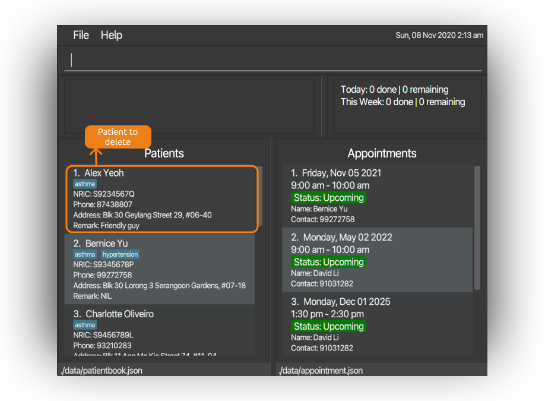

2. Input `delete 1`:
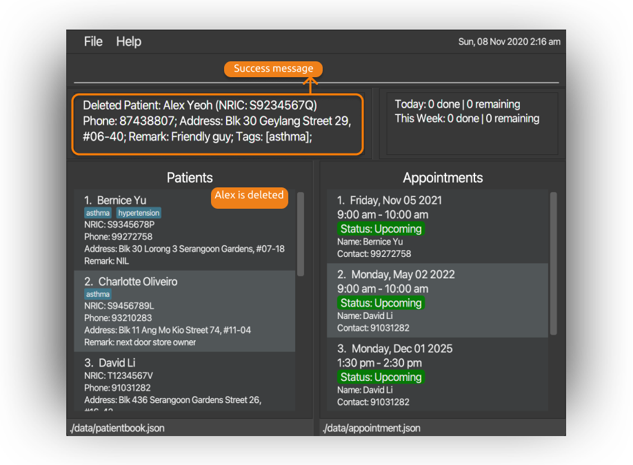
The first patient `Alex Yeoh` is deleted.

3. Input `Undo`:
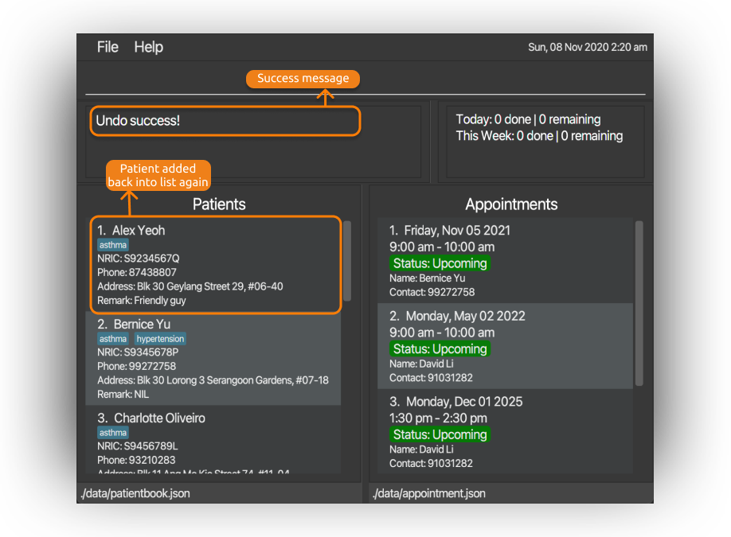
The `undo` command cancels the last undoable command `delete 1`, so that 
the patient `Alex Yeoh` comes back to the list again.

#### Redoing the previously undone command : `redo`

Reverses the most recent `undo` command. `redo` command cannot reverse an `undo` execution from the previous Nuudle session.

Format: `redo`

* There must be at least one previously executed `undo` command.
* The previously executed `undo` command should be the most recent command that modifies the lists' data.
* Multiple call to `redo` will reverse multiple `undo` command, starting from the most recent `undo` command.

Examples:
* `cancel 1`  
  `undo` (reverses the `cancel 1` command) 
  `list` 
  `redo` (reapplies the `cancel 1` command)

* `cancel 1` 
  `undo` (reverses the `cancel 1` command) 
  `cancel 2` 
  `redo` 
   The `redo` command fails as there are no `undo` commands executed previously.

* `cancel 1` 
  `clear` 
  `undo` (reverses the `clear` command) 
  `undo` (reverses the `cancel 1` command) 
  `redo` (reapplies the `cancel 1` command) 
  `redo` (reapplies the `clear` command)

Step by step illustration:
1. Initial state:

2. Input `clear`:
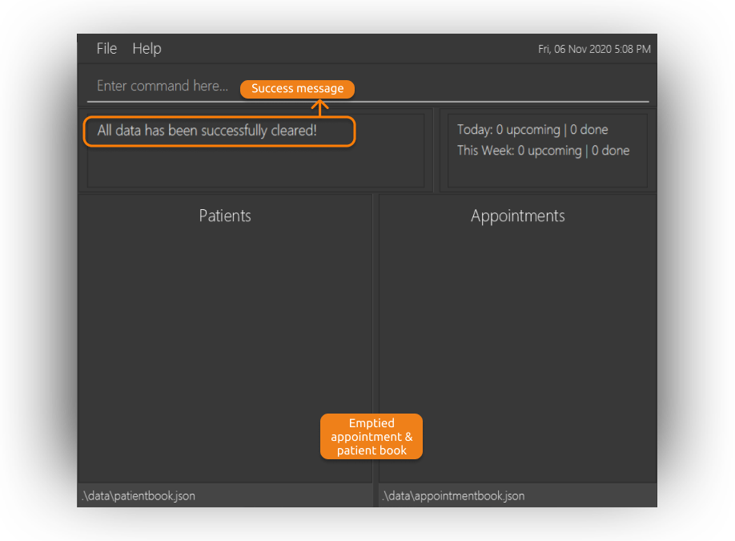

3. Input `Undo`:
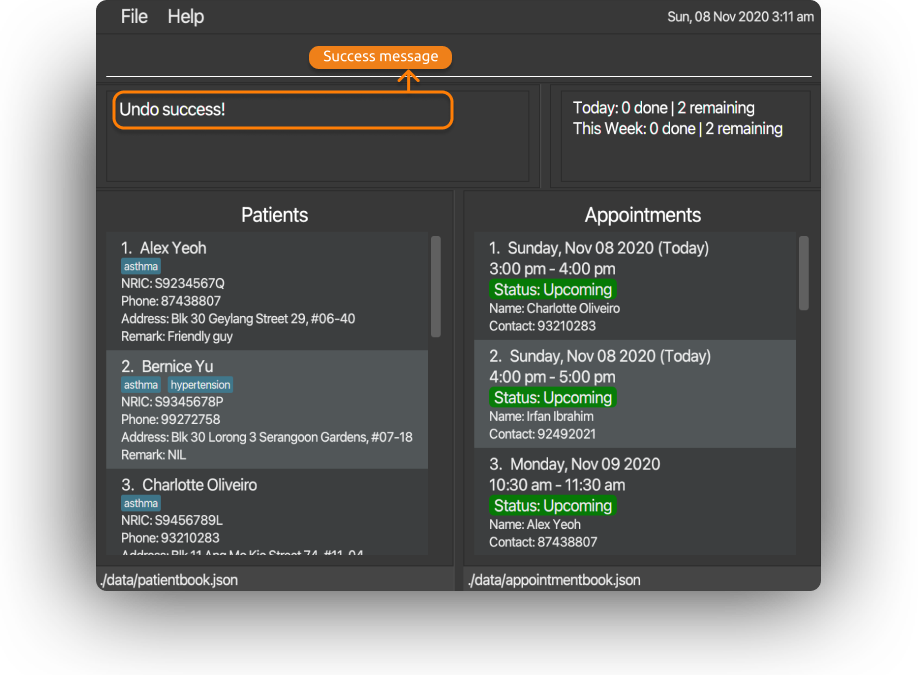
All the data comes back.

4. Input `Redo`:
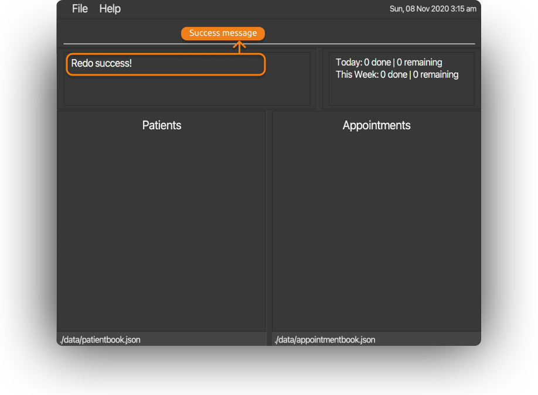
Redo the `clear` command, which removes all the data again.

#### Clearing all data : `clear`

Clears all appointment and patients data.

Format: `clear`

#### Exiting the program : `exit`

Exits Nuudle.

Format: `exit`

#### Searching through entered commands

Pressing the :arrow_up: and :arrow_down: arrows in the command box will display the previous and next input respectively.

#### Saving the data

Patients and appointments data are saved in the hard disk automatically after any command that changes the data. There is no need to save manually.

#### Archiving past appointments

Past appointments are automatically archived and neatly organised into an archive folder for future reference. This is done automatically everytime you start up the Nuudle app.

The appointments are organised by their appointment months and are saved in Comma-Separated Values (CSV) format. CSV files can be opened and viewed as a typical Excel file.

#### Backing up files

The data files of your previous Nuudle session are automatically saved in a folder called `backup`. The backup data will be updated everytime you start up the Nuudle app.

This backup files allow you to completely revert your data to the previous session's data. This is especially useful if your data was unintentionally corrupted and you need to manually restore the data.

--------------------------------------------------------------------------------------------------------------------
### Patient Management

#### Adding a patient : `add`

Adds a patient to the patient book.

Format: `add n/NAME i/NRIC p/PHONE_NUMBER a/ADDRESS [r/REMARK] [t/TAG]…​`

:bulb: **Tip:**
Tags are used to indicate a patient's underlying medical conditions. A patient can have any number of tags (including 0).

* Adds a patient with the specified details.
* The following fields are compulsory and must be provided: `NAME, NRIC, PHONE_NUMBER, ADDRESS`.
* It is optional to add `TAG`s for the patient. Tags can still be added with the edit command upon creating the patient entry in Nuudle.

Examples:
* `add n/John Doe i/S9730284G p/98765432 a/John street, block 123, #01-01`
* `add n/Betsy Crowe i/S9123456G t/friend a/NUS Utown p/1234567 t/asthma`

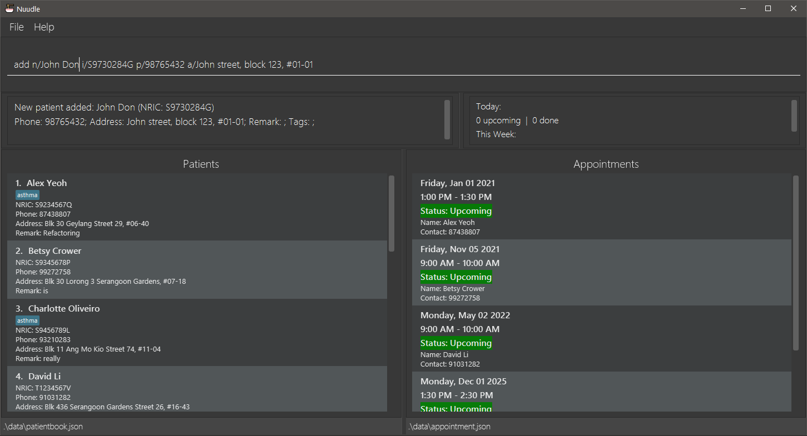

#### Editing a patient : `edit`

Edits an existing patient in the patient book. Existing appointments which include the edited patient will be updated accordingly.

Format: `edit PATIENT_INDEX [n/NAME] [i/NRIC] [p/PHONE_NUMBER] [a/ADDRESS] [r/REMARK] [t/TAG]…​`

* Edits the patient at the specified `PATIENT_INDEX`. The index refers to the index number shown in the displayed patient list. The index **must be a positive integer** 1, 2, 3, …​
* At least one of the optional fields must be provided.
* Existing values will be updated to the input values.
* When editing tags, the existing tags of the patient will be removed i.e adding of tags is not cumulative.
* You can remove all the patients' tags by typing `t/` without specifying any tags after it.
* Existing appointments which include the edited patient will be updated accordingly.

Examples:
*  `edit 1 p/91234567 a/College Avenue 8` Edits the phone number and email address of the 1st patient to be `91234567` and `College Avenue 8` respectively.
*  `edit 2 n/Betsy Crower t/` Edits the name of the 2nd patient to be `Betsy Crower` and clears all existing tags.

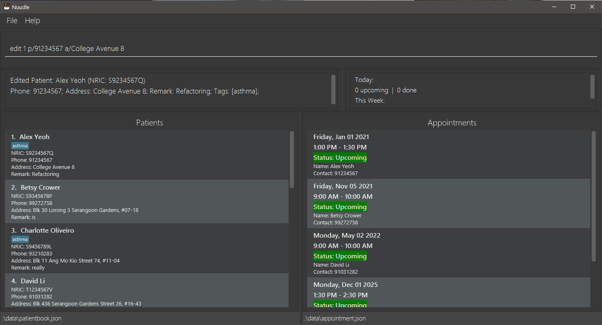

#### Deleting a patient : `delete`

Deletes the specified patient from the patient book.

Format: `delete PATIENT_INDEX`

* Deletes the patient at the specified `PATIENT_INDEX`.
* The index refers to the index number shown in the displayed patient list.
* The index **must be a positive integer** 1, 2, 3, …​
* Deleting a patient will also delete all the appointments of the person.

Examples:
* `list` followed by `delete 2` deletes the 2nd patient in the displayed patient list.
* `find Betsy` followed by `delete 1` deletes the 1st patient in the results of the `find` command.

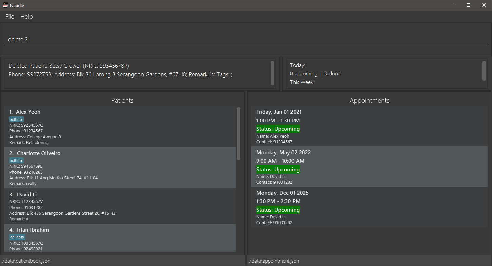

#### Adding a remark for a patient : `remark`

Adds a remark to an existing patient in the patient book for nurses to store additional data unique to the patient.

Format: `remark PATIENT_INDEX [r/REMARK]`

:bulb: **Tip:**
We implemented our remarks feature to empower you with the ability to add extra information to a patient's bio data!
So don't be shy and feel free to add anything under the sun that is applicable for the patient.

* **Adds a remark** for the patient at the specified `PATIENT_INDEX`.
* `PATIENT_INDEX` here refers to the number shown on the left side of the displayed patient book.
* Please note that the index used **must be a positive integer** 1, 2, 3, …​
* A remark is an **optional field** and can be left blank if it is not applicable.
* A patient will have `NIL` displayed as his/her remark status if it was left empty.
* To **override** a remark, simply use the remark command as described above.
 Alternatively, you can also use the edit command to add or edit remarks if you wish to change multiple fields (eg. Phone number) at the same time.
* If you wish to **delete** a patient's remark, simply use either of the following commands:
    * `remark PATIENT_INDEX`
    * `remark PATIENT_INDEX r/`

Examples to add remarks:
*  `remark 2 r/Has been visiting Dr John` Adds a remark `Has been visiting Dr John` to the patient currently displayed second from the top in the patient list.
*  `remark 1 r/Can only converse in mandarin` Adds a remark `Can only converse in mandarin` to the patient currently displayed at the top of the patient list.

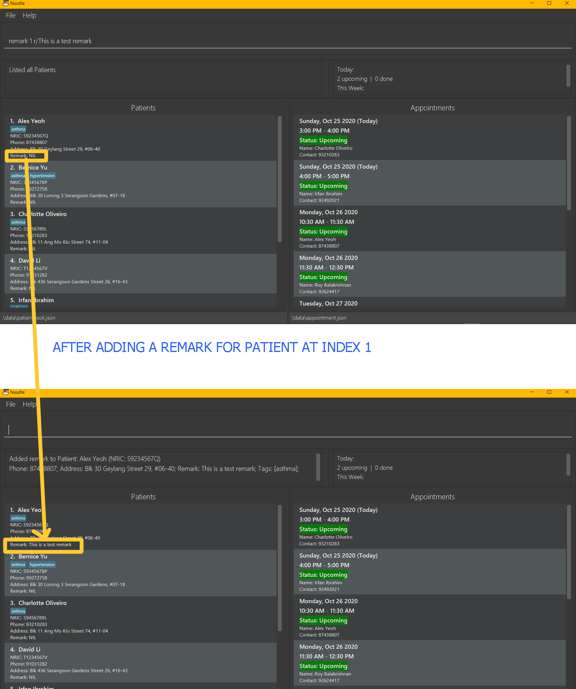
 

Examples to delete the remark for a patient at index 1:
* `remark 1 r/`
* `remark 1`

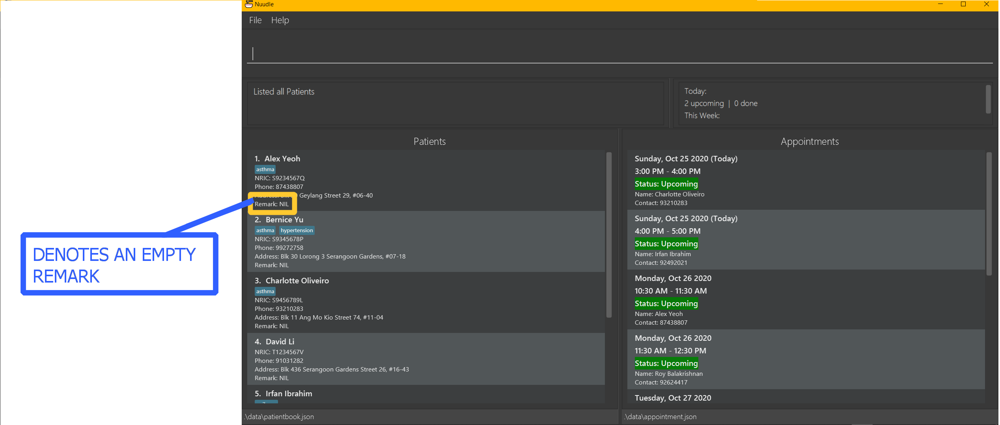
 

#### Listing all patients : `list`

Shows a list of all patients in the patient book.

Format: `list`

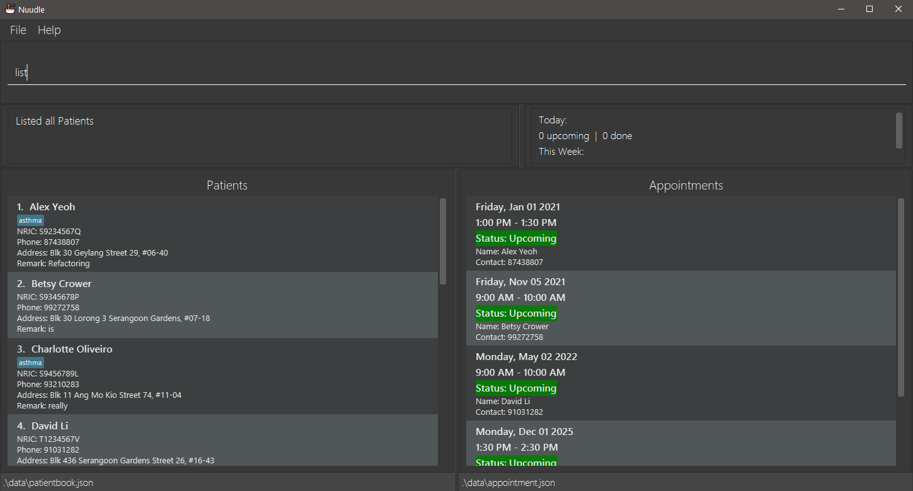

#### Locating patients by name : `find`

Finds patients by name, NRIC or phone numbers.

Format: `find [n/NAME [MORE_NAMES]] [i/NRIC [MORE_NRICS]] [p/PHONE_NUMBER [MORE_PHONE_NUMBERS]] `

* The search is case-insensitive. e.g `hans` will match `Hans`
* The order of the keywords does not matter. e.g. `Hans Bo` will match `Bo Hans`
* Only the name, NRIC, and phone number are searched.
* Only full words will be matched e.g. `Han` will not match `Hans`
* Patients matching at least one keyword will be returned (i.e. `OR` search).
  e.g. `Hans Bo` will return `Hans Gruber`, `Bo Yang`
* The respective appointments of patients matching at least one keyword will also be returned.
* The search requirements cannot be left empty, at least one search requirement (by name, NRIC, or phone number) has to be provided

Examples:
* `find n/John` returns patients whose name contains `john`.
* `find n/alex p/99998888 i/S1234567I` returns patients whose name contains `Alex`, or whose phone number is `99998888`, or whose NRIC number is `S1234567I`. 

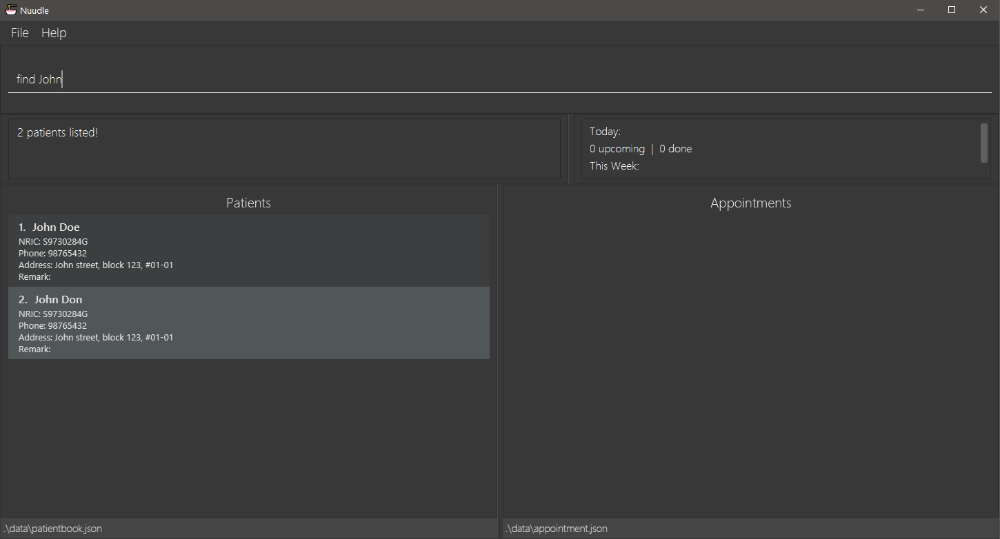

--------------------------------------------------------------------------------------------------------------------
### Appointment Management

#### Adding an appointment : `assign`

Assigns the specified patient into the specified appointment date and time.

Format: `assign PATIENT_INDEX d/DATE t/TIME [dur/DURATION]`

* Puts the patient at the specified `PATIENT_INDEX` into an appointment time slot.
* The `PATIENT_INDEX` refers to the index number indicated in the patient list.
* The `PATIENT_INDEX` **must be a positive integer** 1, 2, 3, …​
* The `DATE` and `TIME` of the appointment must be included.
* The `DURATION` is measured in minutes and will be defaulted to 60 minutes if omitted.
* The time slot indicated by `DATE` and `TIME` must be available.
* The specified `DATE` and `TIME` must be in the future.

Examples:
* `assign 1 d/Sunday t/2pm dur/40` books an appointment of 40 minutes on the upcoming Sunday, 2am for the 1st patient in the list.
* `assign 3 d/02-03-2021 t/1130` books an appointment of 60 minutes on 02/03/2021, 11:30am for the 3rd patient in the list.

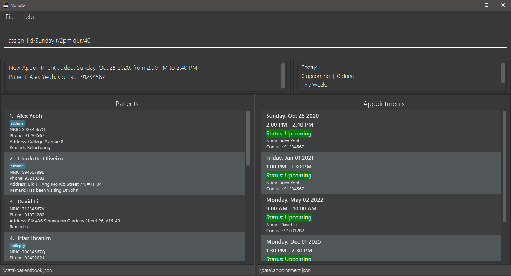

#### Reschedules an appointment for a patient : `change`

Reschedules or modifies an existing appointment with a new date, time or duration.

Do note that the duration used here is **measured in minutes** and must be **at least 10 minutes**!

Format: `change APPT_INDEX [d/DATE] [t/TIME] [dur/DURATION]`

:bulb: **Tip:**
If you would only like to change the duration of an appointment while keeping it's original date and time, simply
enter the new `DURATION` with it's corresponding `APPT_INDEX`! There is no need to retype it's date and time. The same
applies for the other fields.

* **Reschedules an appointment** at the specified `APPT_INDEX` for the patient it is tagged to.
* The `APPT_INDEX` refers to the number shown in the displayed appointment book located on the right side of the UI.
* Please note that the index used **must be a positive integer** 1, 2, 3, …
* Please note that the `DATE` and `TIME` used for rescheduling must be set in the future.
* **At least one** of the optional fields must be present for a successful execution of the change command.

* If you wish to **modify** the duration of an existing appointment, simply call the command in the following format:
    * `change 1 dur/NEW_DURATION`:  Extends the duration of the first appointment at `APPT_INDEX` 1 to the `NEW_DURATION` with the same date and start time.

* Some examples of **rescheduling** an appointment with a new `DATE`,`TIME` or `DURATION`:
    * `change 1 d/NEW_DATE dur/NEW_DURATION`:  Reschedules an appointment to the `NEW_DATE` with the `NEW_DURATION` at it's original `TIME`.
    * `change 1 t/NEW_TIME dur/NEW_DURATION`:  Reschedules an appointment to the `NEW_TIME` with the `NEW_DURATION` at it's original `DATE`.
    * `change 1 d/NEW_DATE t/NEW_TIME dur/NEW_DURATION`:  Reschedules an appointment to the `NEW_DATE` and `NEW_TIME` with the `NEW_DURATION`.
* Any other combinations of the optional fields are supported as well.

Examples to reschedule appointments:
*  `change 3 d/02-03-2021`   Reschedules the 3rd appointment in the appointment book to 2nd March 2021 with it's time, duration and patient.
*  `change 2 d/12-05-2021 t/1530 dur/60`   Reschedules the 2nd appointment in the appointment list to 12th May 2021, 3:30PM with a duration of 1 hour with it's original patient.

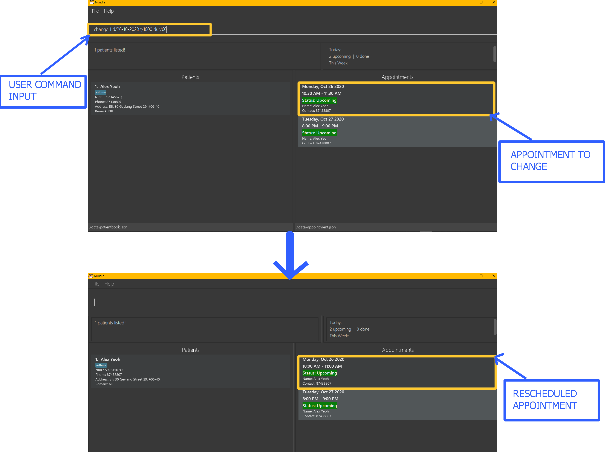

#### Canceling an appointment : `cancel`

Deletes the specified appointment from the appointment book.

Format `cancel APPT_INDEX`

* Deletes the appointment at the specified `APPT_INDEX`.
* The `APPT_INDEX` refers to the index number indicated in the displayed appointment list.
* The `APPT_INDEX` **must be a positive integer** 1, 2, 3, …​

Example:
* `view` followed by `cancel 2` deletes the 2nd appointment in the displayed appointment list.
* `view d/today` followed by `cancel 1` deletes the 1st appointment happening on today's date (if it exists).

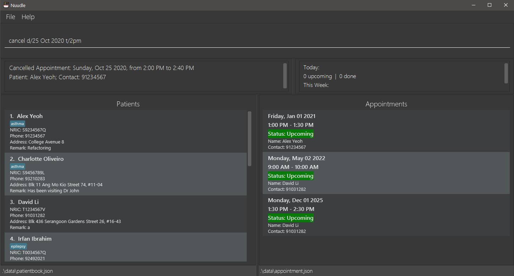

#### Marking an appointment as done : `done`

Marks a specific appointment in the patient book as done.

Format: `done APPT_INDEX`

* Marks the appointment at the specified `APPT_INDEX` as done.
* The `APPT_INDEX` refers to the index number indicated in the displayed appointment list.
* The `APPT_INDEX` **must be a positive integer** 1, 2, 3, …​
* The indicated appointment should be an appointment that has not been marked before.

Example:
* `done 3` marks the 3rd appointment in the displayed appointment list as completed.
* `view d/today` followed by `done 1` marks the 4th appointment happening on today's date as completed.
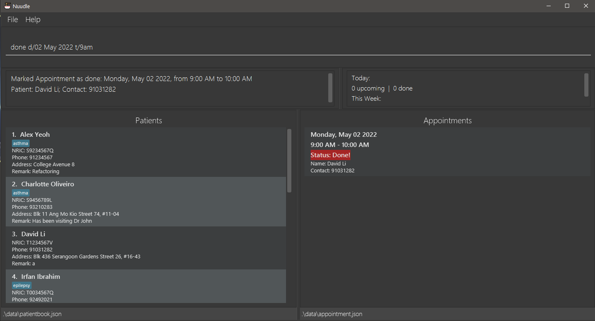

#### Listing upcoming appointments by date : `view`

Shows a list of all upcoming appointments entries or only the list of upcoming appointments happening on the specified date.

Format `view [d/DATE]`

* Outputs the list of all upcoming appointments happening on the specified date in chronological order.
* The specified `DATE` must be in the future.
* If `DATE` is not specified, `view` will output the list of **all** upcoming appointments in chronological order.

Example:
* `view` shows the list of all upcoming appointments in chronological order.
* `view d/4-Aug-2020` shows the list of appointments happening on 04/08/2020.

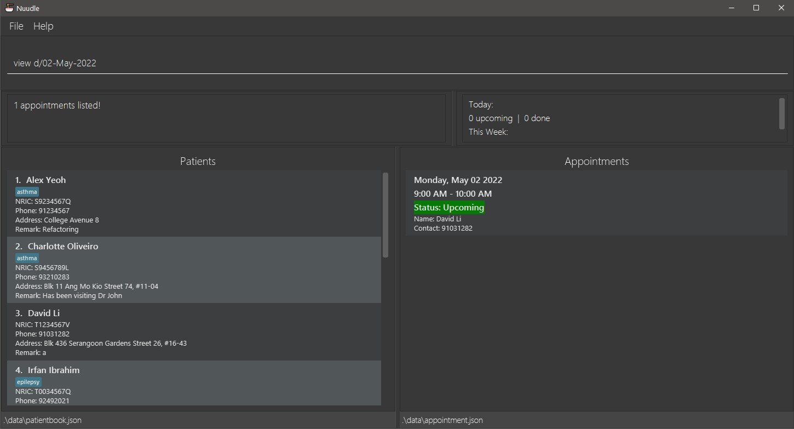

#### Listing available time slots by date : `avail`

Shows a list of all available (free) time slots within the operation time of the clinic on a specified date.

Format: `avail d/DATE`

* Outputs the list of all available time slots within the operation time of the clinic on a specified date in chronological order.
* `DATE` must be today or in the future.

Example:
* `avail d/4-Aug-2020` shows the list of all available (free) time slots within the operation time of the clinic on 04/08/2020.
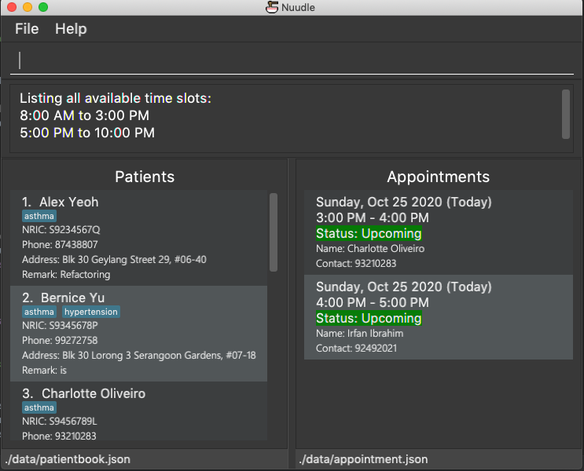

### Command summary

TODO: SPLIT TO 3

Action | Format, Examples
--------|------------------
**Add** | `add n/NAME i/NRIC p/PHONE_NUMBER a/ADDRESS [t/TAG]…​`   e.g., `add n/James Ho i/S9712345G p/22224444 a/123, Clementi Rd, 1234665 t/asthma t/`
**Delete** | `delete PATIENT_INDEX`  e.g., `delete 3`
**Edit** | `edit PATIENT_INDEX [n/NAME] [p/PHONE_NUMBER] [i/NRIC] [a/ADDRESS] [t/TAG]…`  e.g.,`edit 2 n/James Lee a/College Avenue 8`
**Find** | `find KEYWORD [MORE_KEYWORDS]`  e.g., `find James Jake`
**List** | `list`
**Remark** | `remark PATIENT_INDEX [r/REMARK]`  e.g., `remark 2 r/Has been visiting Dr John`, `remark 2`
**Assign** | `assign PATIENT_INDEX d/DATE t/TIME`  e.g., `assign 3 d/tomorrow t/3pm`
**Cancel** | `cancel APPT_INDEX`  e.g., `cancel 1`
**Change** | `change APPT_INDEX d/DATE t/TIME dur/DURATION`   e.g., `change 3 d/02-03-2021 t/1130 dur/30`
**View** | `view [d/DATE]`  e.g., `view d/today`
**Done** | `done APPT_INDEX`  e.g., `done 2`
**Available** | `avail d/DATE`  e.g., `avail d/12-Apr-2021`
**Clear** | `clear`
**Undo** | `undo`
**Redo** | `redo`
**Help** | `help`
**Exit** | `exit`

--------------------------------------------------------------------------------------------------------------------

## FAQ

**Q**: How do I transfer my data to another Computer? 
**A**: Install the app in the other computer and overwrite the empty data file it creates with the file that contains the data of your previous Nuudle home folder.

**Q**: What are the acceptable date time format? 
**A**: Nuudle supports multiple date time formats as well as natural date time language :

Date Formats | Time Formats | Natural Date | Natural Time
:---------------:|:----------------:|:----------------:|:----------------:
02/12/2020 | 2300 | Today | Morning (8AM)
02-12-2020 | 11:00PM | Tomorrow | Noon (12PM)
12/02/2020 | 11.00PM | Yesterday | Evening (7PM)
12-02-2020 | 11PM | Upcoming day of the week | Night (10PM)
2020/12/02 | | | Midnight (11:59PM)
2020-12-02 |
02-Dec-2020 |
02-December-2020 |

**Q**: My data was accidentally deleted and I can't undo it. How do I restore my data? 
**A**: Look for the `data` folder in the home directory of Nuudle and then look for a `backup` folder. Copy the 2 data files in the `backup` folder and paste them into the previous folder (`data`).
The previous session's data will then be restored by overwriting the current data files with the backup data files.
